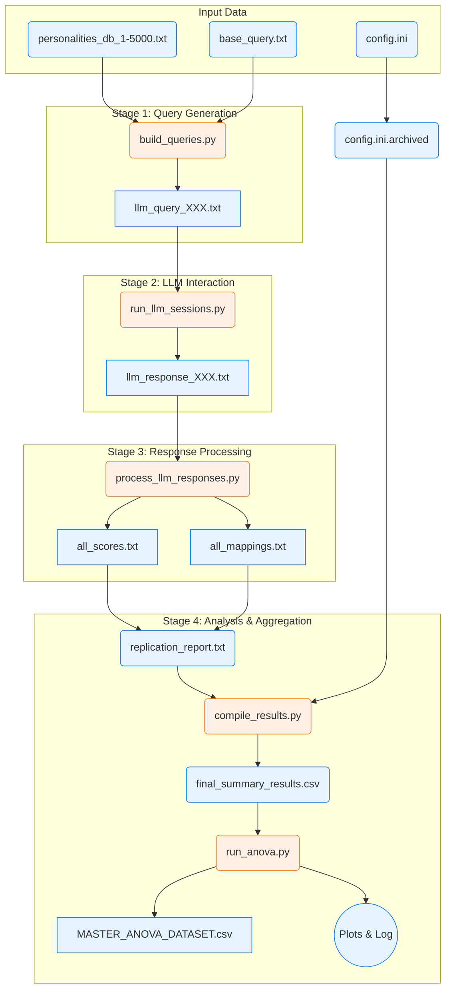
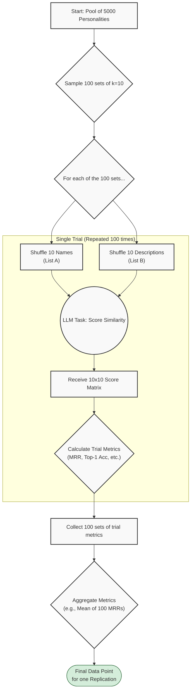

# LLM Personality Matching Experiment Pipeline

This project provides a fully automated and reproducible pipeline for testing a Large Language Model's (LLM) ability to solve a "who's who" personality matching task. It handles everything from data preparation and query generation to LLM interaction, response parsing, and final statistical analysis.

## Key Features

-   **Automated Experiment Runner**: A single command executes an entire experiment, running dozens of replications, each with hundreds of trials.
-   **Guaranteed Reproducibility**: Each replication automatically archives the `config.ini` file used for that run, permanently linking the results to the exact parameters that generated them.
-   **Robust Error Handling & Resumption**: The pipeline is designed for resilience. Interrupted runs can be safely resumed. The system automatically backs up the old log and rebuilds a clean version from existing reports, ensuring data integrity.
-   **Advanced Artifact Management**:
    -   **Reprocessing Engine**: The main runner has a `--reprocess` mode to re-run the analysis stages on existing experimental data, with a `--depth` parameter for recursive scanning.
    -   **Configuration Restoration**: Includes utilities to reverse-engineer and archive `config.ini` files for historical data that was generated before the auto-archiving feature was implemented.
-   **Hierarchical Analysis**: The `compile_results.py` script performs a bottom-up aggregation of all data. It creates a `final_summary_results.csv` within every run directory and then aggregates these into master summaries at each higher level of your project folder, creating a fully auditable research archive.
-   **Streamlined ANOVA Workflow**: The final statistical analysis is now a simple two-step process. `compile_results.py` first prepares a master dataset, which `run_anova.py` then automatically finds and analyzes, generating tables and publication-quality plots.
-   **Informative Console Output**: By default, the runner provides a clean, high-level console output. A `-Verbose` flag is available to enable detailed, real-time logs for debugging.

## Visual Architecture

The project's architecture can be understood through three different views: the code architecture, the data flow, and the experimental logic.

### 1. Code Architecture Diagram

This diagram shows how the scripts in the pipeline call one another, illustrating the hierarchy of control.

```mermaid
graph TD;

    %% --- Style Definitions ---
    classDef ExperimentRunner fill:#1f77b4,stroke:#fff,stroke-width:2px,color:#fff;
    classDef ReplicationManager fill:#ff7f0e,stroke:#fff,stroke-width:2px,color:#fff;
    classDef Stage fill:#2ca02c,stroke:#333,stroke-width:1px,color:#fff;
    classDef Utility fill:#d62728,stroke:#333,stroke-width:1px,color:#fff;
    classDef Worker fill:#9467bd,stroke:#333,stroke-width:1px,color:#fff;
    classDef Legacy fill:#8c564b,stroke:#333,stroke-width:1px,color:#fff;

    %% --- Node Definitions ---
    subgraph "Experiment Execution"
        run_exp["run_experiment.ps1<br/><i>(Main Entry Point)</i>"]:::ExperimentRunner;
        rep_man["replication_manager.py<br/><i>(Manages Batch of Replications)</i>"]:::ReplicationManager;
    end

    subgraph "Utilities & Final Analysis"
        direction LR
        subgraph "Standard Utilities"
            retry["retry_failed_sessions.py"]:::Utility;
            compile["compile_results.py"]:::Utility;
            anova["run_anova.py"]:::Utility;
            verify["verify_pipeline_completeness.py"]:::Utility;
            rebuild_log["rebuild_batch_log.py"]:::Utility;
        end
        subgraph "Historical Data Patching"
            patcher["patch_old_runs.py"]:::Utility;
            restorer["restore_config.py"]:::Worker;
        end
        inject["inject_metadata.py<br/><i>(Legacy)</i>"]:::Legacy;
    end

    subgraph "Single Replication Pipeline (Python Scripts)"
        direction LR;
        orch["orchestrate_replication.py<br/><i>(Single Replication Orchestrator)</i>"]:::Stage;
        subgraph "Stage 1: Query Generation"
            build["build_queries.py"]:::Stage;
            qgen["query_generator.py"]:::Worker;
        end
        subgraph "Stage 2: LLM Interaction"
            sessions["run_llm_sessions.py"]:::Stage;
            prompter["llm_prompter.py"]:::Worker;
        end
        subgraph "Stage 3 & 4: Analysis"
            process["process_llm_responses.py"]:::Stage;
            analyze["analyze_performance.py"]:::Stage;
        end
    end

    %% --- Connection Definitions ---
    run_exp --> |"Calls"| rep_man;
    rep_man --> |"Calls in loop (x30)"| orch;
    run_exp --> |"Calls for auto-repair"| retry;
    run_exp --> |"Calls to summarize batch"| compile;
    
    orch --> |"Calls"| build;
    build --> |"Calls worker in loop (x100)"| qgen;
    orch --> |"Calls"| sessions;
    sessions --> |"Calls worker in loop (x100)"| prompter;
    orch --> |"Calls"| process;
    orch --> |"Calls"| analyze;
    
    retry --> |"Calls to re-run specific queries"| sessions;
    retry --> |"Re-runs after fixes"| process;
    retry --> |"Re-runs after fixes"| analyze;
    retry --> |"Re-runs after fixes"| compile;
    
    compile -.-> |"[Data Flow]"| anova;
    patcher --> |"Calls in loop"| restorer;
```



### 2. Data Flow Diagram

This diagram shows how data artifacts (files) are created and transformed by the pipeline scripts.



### 3. Experimental Logic Flowchart

This diagram illustrates the scientific methodology for a single replication run.



## Setup and Installation

1.  **Create Virtual Environment**:
    ```bash
    python -m venv .venv
    ```

2.  **Activate Environment**:
    *   On Windows (PowerShell): `.venv\Scripts\Activate.ps1`
    *   On macOS/Linux: `source .venv/bin/activate`

3.  **Install Dependencies**:
    ```bash
    pip install -r requirements.txt
    ```

4.  **Configure API Key**:
    *   Create a file named `.env` in the project root.
    *   Add your API key: `OPENROUTER_API_KEY=sk-or-your-key`.

## Standard Workflow

The workflow is designed to be fully automated. Each experiment run produces self-documenting output, which simplifies the final analysis.

### Phase 1: Running Experiments

The main entry point for executing a complete experiment (e.g., all 30 replications for a single LLM) is the `run_experiment.ps1` PowerShell script.

1.  **Configure**:
    *   Ensure your environment is set up and your API key is in the `.env` file.
    *   Adjust experimental parameters in `config.ini`. For example, to run the experiment with a random name-to-description mapping, you would set `mapping_strategy = random`.

2.  **Execute**:
    *   Open a PowerShell terminal (with the virtual environment activated) and run the main experiment script.
    ```powershell
    # Run with standard (quiet) output
    .\run_experiment.ps1

    # For detailed debugging, run with the -Verbose switch
    .\run_experiment.ps1 -Verbose
    ```
    *   The script manages the entire batch run. It will first run all replications, then automatically enter a repair phase for any failures.
    *   **Crucially**, each replication's output directory will now contain a `config.ini.archived` file, making it a self-contained, reproducible artifact.

3.  **Repeat for All Conditions**: Repeat steps 1-2 for each experimental condition you want to compare. It is best practice to organize the outputs into separate folders.
    *   Run once with `mapping_strategy = correct` and save the output to a folder like `output/reports/exp_mistral_correct_map`.
    *   Run again with `mapping_strategy = random` and save to `output/reports/exp_mistral_random_map`.

### Phase 2: Compiling Results and Final Analysis

After running all experiments, this phase aggregates all data and performs the final statistical analysis. This is now a streamlined two-step process.

1.  **Compile All Results**: Use `compile_results.py` and point it at the parent directory containing all your experiment folders (e.g., `output/reports`). The script will automatically:
    *   Scan the entire directory structure from the bottom up.
    *   Create a `final_summary_results.csv` inside every single run folder, containing key metrics like MRR and Top-1 Accuracy.
    *   Create aggregated `final_summary_results.csv` files at each higher level.
    *   Finally, create a single **master summary file** at the top level you specified.
    ```powershell
    # Compile all results within the 'reports' folder into a master dataset
    python src/compile_results.py output/reports
    ```

2.  **Run Final Analysis**: Now, run `run_anova.py` on the **same directory**. It will automatically find the master summary CSV created in the previous step and use it as its data source.
    ```powershell
    # Analyze the master dataset created by compile_results.py
    python src/run_anova.py output/reports
    ```

3.  **Review Final Artifacts**: In the analysis directory (`output/reports/`), you will now find:
    *   Hierarchical `final_summary_results.csv` files at every level.
    *   `MASTER_ANOVA_DATASET.csv`: The aggregated data used for the final analysis.
    *   Publication-quality **box plot `*.png` images**.
    *   A complete `MASTER_ANOVA_DATASET_analysis_log.txt` with all statistical tables (ANOVA, Tukey's HSD, etc.).

## Maintenance and Utility Scripts

The project includes several scripts for maintenance, diagnostics, and handling historical data.

*   **`replication_manager.py --reprocess`**:
    *   The main runner can be invoked in a reprocessing mode to fix or update the analysis for existing runs without re-running the expensive LLM sessions.
    *   Usage: `python src/replication_manager.py --reprocess path/to/experiment --depth 1`

*   **`patch_old_runs.py`**:
    *   **Utility for historical data.** Scans a directory for old experiment runs that are missing a `config.ini.archived` file and generates one for each by reverse-engineering the `replication_report.txt`. Supports recursive scanning with `--depth`.
    *   Usage: `python src/patch_old_runs.py "path/to/old/experiments" --depth -1`

*   **`log_manager.py`**:
    *   The core utility for automated log management. It is called by the main runner with commands like `start`, `rebuild`, and `finalize`.
    *   Can be run manually for maintenance, for example, to safely rebuild a log from existing reports: `python src/log_manager.py rebuild "path/to/experiment/folder"`

*   **`retry_failed_sessions.py`**:
    *   Used automatically by the main runner for the repair cycle. Can be run manually to fix failed API calls in a specific run.

*   **`verify_pipeline_completeness.py`**:
    *   A diagnostic tool to check for missing files or incomplete stages in a run directory.

*   **`inject_metadata.py`**:
    *   **LEGACY UTILITY:** This script is no longer part of the standard workflow. It should only be used in rare cases for one-off data labeling where the standard `config.ini` archiving is not feasible.

## Testing

The project includes a suite of unit and integration tests. To run them, use `pytest`:

```bash
# Ensure you have pytest installed: pip install pytest
pytest -v
```