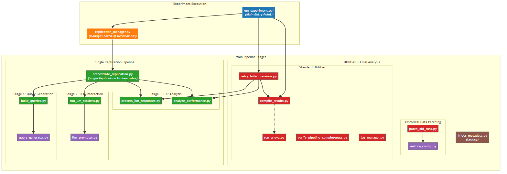
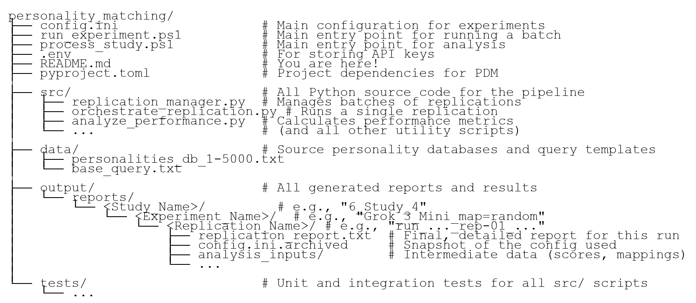

<!-- 
!! DO NOT EDIT THIS FILE DIRECTLY !!
This file is generated from README.template.md by the build_docs.py script.
Any changes made here will be overwritten.
-->

# LLM Personality Matching Experiment Framework

This project provides a fully automated and reproducible pipeline for testing a Large Language Model's (LLM) ability to solve a "who's who" personality matching task. It handles everything from data preparation and query generation to LLM interaction, response parsing, and final statistical analysis.

## Research Question
At its core, this project investigates whether a Large Language Model (LLM) can solve a complex matching task: given a set of sanitized, narrative personality descriptions (derived from birth data) and a corresponding set of general biographical profiles, can the LLM correctly pair them at a rate significantly greater than chance?

This study introduces a novel methodological twist to probe the limits of LLM pattern recognition. The link between the narrative descriptions and the biographical profiles is a faint, systematic signal generated by a deterministic, non-scientific system (an astrology program). This transforms the experiment into a rigorous test of an LLM's ability to detect subtle, rule-based patterns within a noisy, high-dimensional dataset. The central question is not about the validity of the generating system, but about the capability of the AI to find a signal in its output.

## A Note on Stimulus Generation and Experimental Design
The experiment is built upon a custom database of 5,000 famous historical individuals, for whom accurate and verified birth data (date, time, place) was meticulously collected. This population was chosen for two reasons:

*   **Signal Integrity**: Accurate birth data ensures the deterministic generation of consistent personality narratives.
*   **Task Feasibility**: The public prominence of these individuals makes it plausible that LLMs have encountered their biographical information during training, making the matching task tractable.

To create a uniquely challenging test, we employed a two-step process to generate textual stimuli for each trial:

1.  **Generation**: A commercial astrology program was used as a "black box" function to deterministically map an individual's birth data to a narrative description. The generation was intentionally constrained to a foundational subset of the algorithm's rules (e.g., categorical placements and dominances), creating a signal of limited complexity.
2.  **Sanitization**: An LLM was then used to programmatically rewrite these descriptions, removing all explicit references to astrology, planets, or other esoteric terms.

The result is a clean dataset of personality profiles where the connection to the individual's biographical profile is systematic but non-obvious.

**Crucially, this study does not seek to validate astrology.** Instead, it treats the generating program as an arbitrary, complex algorithm. The scientific objective is to determine whether an LLM, a third-party pattern-recognition system, can detect the subtle statistical regularities produced by this algorithm and use them to perform a successful matching task. The findings speak to the profound capabilities of LLMs to find signal in noisy, high-dimensional data, regardless of the source's theoretical basis.

## Key Features

-   **Automated Experiment Runner**: A single command executes an entire experiment, running dozens of replications, each with hundreds of trials.
-   **Standardized, Reproducible Reporting**: Each replication produces a comprehensive, consistently formatted report that includes run parameters, the base query, a human-readable analysis summary, and a machine-readable JSON block. The format is identical whether running a new experiment or reprocessing an old one.
-   **Guaranteed Reproducibility**: Each replication automatically archives the `config.ini` file used for that run, permanently linking the results to the exact parameters that generated them.
-   **Robust Error Handling & Resumption**: The pipeline is designed for resilience. Interrupted runs can be safely resumed. The `rebuild` command ensures data integrity after an interruption, and the `finalize` command is idempotent, automatically cleaning up corrupted summary data before writing a correct final version.
-   **Advanced Artifact Management**:
    -   **Reprocessing Engine**: The main runner has a `--reprocess` mode to re-run the analysis stages on existing experimental data, with a `--depth` parameter for recursive scanning. You can even add or override run notes during reprocessing.
    -   **Configuration Restoration**: Includes utilities to reverse-engineer and archive `config.ini` files for historical data that was generated before the auto-archiving feature was implemented.
-   **Hierarchical Analysis**: The `compile_results.py` script performs a bottom-up aggregation of all data. It now generates **level-aware summary files**: `REPLICATION_results.csv` in each replication folder, `EXPERIMENT_results.csv` at the experiment level, and a final master `STUDY_results.csv` at the top study level. This creates a fully auditable and easily navigable research archive.
-   **Streamlined ANOVA Workflow**: The final statistical analysis is now a simple two-step process. `compile_results.py` first prepares a master dataset, which `run_anova.py` then automatically finds and analyzes, generating tables and publication-quality plots using user-friendly display names for factors and metrics.
-   **Smart Console Output**: The main `process_study.ps1` wrapper provides a clean, high-level summary of compilation and analysis steps, showing progress without overwhelming detail. A `-Verbose` flag is available to switch to real-time raw output for debugging.

## Visual Architecture

The project's architecture can be understood through three different views: the code architecture, the data flow, and the experimental logic.

### 1. Code Architecture Diagram

This diagram shows how the scripts in the pipeline call one another, illustrating the hierarchy of control.

{width=100%}

### 2. Data Flow Diagram

This diagram shows how data artifacts (files) are created and transformed by the pipeline scripts.

{width=100%}

### 3. Experimental Logic Flowchart

This diagram illustrates the scientific methodology for a single replication run.

{width=100%}

## Project Structure

The project's experiments are organized in a logical hierarchy:

-   **Study**: The highest-level grouping, representing a major research question (e.g., "Performance on Random vs. Correct Mappings").
-   **Experiment**: A complete set of runs for a single condition within a study (e.g., "Gemini 2.0 Flash with k=10 Subjects").
-   **Replication**: A single, complete run of an experiment, typically repeated 30 times for statistical power.
-   **Trial**: An individual matching task performed within a replication, typically repeated 100 times.

This logical hierarchy is reflected in the directory structure of the project and its outputs:

{width=100%}

## Setup and Installation

This project uses **PDM** for dependency and environment management.

1.  **Install PDM (One-Time Setup)**:
    If you don't have PDM, install it once with pip. It's best to run this from a terminal *outside* of any virtual environment.
    ```bash
    pip install --user pdm
    ```
    > **Note:** If `pdm` is not found in a new terminal, use `python -m pdm` instead.

2.  **Install Project Environment & Dependencies**:
    From the project's root directory, run the main PDM installation command. The `-G dev` flag installs all packages, including the development tools needed to run the test suite.
    ```bash
    pdm install -G dev
    ```
    This command creates a local `.venv` folder and installs all necessary packages into it.

3.  **Configure API Key**:
    *   Create a file named `.env` in the project root.
    *   Add your API key: `OPENROUTER_API_KEY=sk-or-your-key`.

To run any project command, such as the test suite, prefix it with `pdm run`:
```bash
pdm run test
```

> **For Developers:** If you intend to contribute to the project or encounter issues with the simple setup, please see the **[Developer Setup Guide in CONTRIBUTING.md](CONTRIBUTING.md#getting-started-development-environment-setup)** for more detailed instructions and troubleshooting.

## Configuration (`config.ini`)

The `config.ini` file is the central hub for defining all parameters for your experiments. The pipeline automatically archives this file with the results for guaranteed reproducibility.

### Display Name Settings

-   **`[ModelDisplayNames]`**: Maps sanitized model names to friendly names (e.g., `meta-llama-4-maverick = Llama 4 Maverick`).
-   **`[FactorDisplayNames]`**: Maps factor names to plot labels (e.g., `mapping_strategy = Mapping Strategy`).
-   **`[MetricDisplayNames]`**: Maps metric names to plot titles (e.g., `mean_mrr = Mean Reciprocal Rank (MRR)`).

### Experiment Settings (`[Study]`)

-   **`num_replications`**: The number of times the experiment will be repeated (e.g., `30`).
-   **`mapping_strategy`**: A key experimental variable. Can be `correct` or `random`.

### LLM Settings (`[LLM]`)

-   **`model_name`**: The API identifier for the LLM to be tested (e.g., `mistralai/mistral-small-3.1-24b-instruct`).

#### Model Selection Philosophy and Future Work
The selection of models for this study was guided by a balance of performance, cost, speed, and technical compatibility with the automated framework. Several top-tier models were not included for one of the following reasons:
-   **Prohibitive Cost**: Models like `o1 pro`, `GPT 4.5 Preview`, and `Claude 4 Opus` were excluded as a single experiment (requiring ~3,000 queries) was financially infeasible.
-   **Technical Incompatibility**: Models like `Gemini 2.5 Pro` lacked a "non-thinking" mode, making the automated parsing of a structured response table overly challenging.
-   **Excessive Runtime**: A number of large models, including `Qwen3 235B` and `Llama 3.1 Nemotron Ultra 253B`, were excluded as a full experimental run would take longer than 20 hours.

A follow-up study is planned to evaluate other powerful, medium-cost models as API costs decrease and technical features evolve. Candidates include: `Grok 3`, `Claude 4 Sonnet`, `Claude 3.7 Sonnet`, `GPT-4o`, `o3`, `GPT-4.1`, `Mistral Large 2`, `Gemini 1.5 Pro`, and various `o1`/`o3`/`o4` mini-variants.

### Analysis Settings (`[Analysis]`)

-   **`min_valid_response_threshold`**: Minimum average number of valid responses (`n_valid_responses`) for an experiment to be included in the final analysis. Set to `0` to disable.

## Standard Workflow

The workflow is designed to be fully automated.

### Phase 1: Running Experiments

The `run_experiment.ps1` PowerShell script is the main entry point for executing a complete experiment.

1.  **Configure**: Adjust experimental parameters in `config.ini`.

2.  **Execute**: Open a PowerShell terminal (with the virtual environment activated) and run the main script.
    ```powershell
    # Run with standard output
    .\run_experiment.ps1

    # Add descriptive notes to the report
    .\run_experiment.ps1 -Notes "First run with random mapping strategy"

    # For detailed debugging, run with the -Verbose switch
    .\run_experiment.ps1 -Verbose
    ```
    *   The script manages the entire batch run. It automatically detects and **skips** any replications that have already been completed successfully. This allows you to safely resume an interrupted batch run without re-doing work. To force a re-analysis of existing data, you must use the `--reprocess` mode described in the maintenance section.
    *   The script will then automatically enter a repair phase for any failed replications from the current batch.
    *   **Crucially**, each replication's output directory will now contain a `config.ini.archived` file, making it a self-contained, reproducible artifact.

3.  **Repeat for All Conditions**: Repeat steps 1-2 for each experimental condition, organizing the outputs into separate folders.

### Phase 2: Processing the Study

After running all experiments, this phase aggregates all data and performs the final statistical analysis.

1.  **Run Study Processor**: Execute `process_study.ps1`, pointing it at the top-level directory containing all experiment folders.
    ```powershell
    .\process_study.ps1 -StudyDirectory "output/reports"
    ```
    This automates two stages:
    *   **Compilation**: Runs `compile_results.py` to scan the directory tree and create level-specific summaries, aggregating them into a master `STUDY_results.csv`.
    *   **Analysis**: Runs `run_anova.py` on the master dataset to perform a full statistical analysis.

2.  **Review Final Artifacts**: In the top-level analysis directory (`output/reports/anova/`), you will find publication-quality plots (`*.png`), a complete analysis log (`STUDY_analysis_log.txt`), and an `archive/` of previous results.

## Standardized Output

The pipeline now generates a consistent, standardized `replication_report.txt` for every run, whether it's a new experiment or a reprocessed one. This ensures that all output is easily comparable and machine-parsable.

### Replication Report Format

Each report contains a clear header, the base query used, a human-readable analysis summary, and a machine-readable JSON block with all calculated metrics.

{width=100%}

**Date Handling by Mode:**
-   **Normal Mode**: The report title is `REPLICATION RUN REPORT` and the `Date` field shows the time of the original run.
-   **`--reprocess` Mode**: The report title is `REPLICATION RUN REPORT (YYYY-MM-DD HH:MM:SS)` with the reprocessing timestamp. The `Date` field continues to show the time of the **original** run for clear traceability.

### Study Analysis Log Format

The final analysis script (`run_anova.py`) produces a comprehensive log file detailing the full statistical analysis of the entire study. The report is structured by metric, with each section providing descriptive statistics, the ANOVA summary, post-hoc results (if applicable), and performance groupings.

{width=100%}

## Migrating Old Experiment Data

A one-time migration process is required to upgrade older, incompatible data directories.

#### Migration Steps

Ensure your Python environment is activated before running these commands from the project root directory.

**A. Manual Steps**

1.  **Patch Configs:** This archives the `config.ini` file in each `run_*` subdirectory.
    ```bash
    python src/patch_old_runs.py "<path_to_old_experiment_dir>"
    ```

2.  **Rebuild Reports:** This uses the archived configs to regenerate each `replication_report.txt` with a modern structure and a valid `METRICS_JSON` block.
    ```bash
    python src/rebuild_reports.py "<path_to_old_experiment_dir>"
    ```

3.  **Clean Artifacts:** Manually delete the following old files and directories from within the `<path_to_old_experiment_dir>`:
    - The top-level `final_summary_results.csv` or `STUDY_results.csv`.
    - The top-level `batch_run_log.csv`
    - The `analysis_inputs` directory inside *each* `run_*` subdirectory.
    - All `*.txt.corrupted` files inside *each* `run_*` subdirectory.

4.  **Final Reprocess:** This will regenerate the summary CSV files, logs, and all analysis artifacts using the modern, rebuilt reports. You can also add notes during this step.
    ```bash
    python src/replication_manager.py --reprocess "<path_to_old_experiment_dir>" --notes "Migrated to new format"
    ```

**B. Automated Scripts**

Scripts are provided to automate all four steps for Windows environments (`migrate_old_experiment.ps1` and `.bat`).

---

## Maintenance and Utility Scripts

*   **`replication_manager.py`**:
    *   The main batch runner for managing multiple replications. Can be invoked in a reprocessing mode (`--reprocess`) to fix or update the analysis for existing runs without re-running expensive LLM sessions. Can also add/override run notes (`--notes`).
    *   Usage: `python src/replication_manager.py path/to/experiment --reprocess --depth 1`

*   **`rebuild_reports.py`**:
    *   A powerful utility to regenerate complete `replication_report.txt` files from the ground-truth archived config. Useful for applying fixes to the processing or analysis stages across an entire study.
    *   Usage: `python src/rebuild_reports.py path/to/study`

*   **`patch_old_runs.py`**:
    *   **Utility for historical data.** Scans a directory for old experiment runs that are missing a `config.ini.archived` file and generates one for each by reverse-engineering the `replication_report.txt`. Supports recursive scanning with `--depth`.
    *   Usage: `python src/patch_old_runs.py "path/to/old/experiments" --depth -1`

*   **`log_manager.py`**:
    *   The core utility for automated log management. Called by the main runner but can also be used manually.
    *   `start`: Archives any old log and creates a new, empty one with a header.
    *   `rebuild`: Recreates the log from scratch by parsing all existing replication reports in a directory.
    *   `finalize`: Cleans any existing summary from the log, recalculates a correct summary, and appends it.

*   **`retry_failed_sessions.py`**:
    *   Used automatically by the main runner for the repair cycle. Can be run manually to fix failed API calls in a specific run.

*   **`verify_pipeline_completeness.py`**:
    *   A diagnostic tool to check for missing files or incomplete stages in a run directory.

*   **`inject_metadata.py`**:
    *   **LEGACY UTILITY:** No longer part of the standard workflow.

*   **`compile_results.py`**:
    *   The core script for hierarchical data aggregation. Recursively scans a directory structure, performing a bottom-up summary.
    *   **Generates level-aware filenames**: `REPLICATION_results.csv`, `EXPERIMENT_results.csv`, and `STUDY_results.csv`.
    *   Usage: `python src/compile_results.py path/to/study`

*   **`run_anova.py`**:
    *   Performs a comprehensive statistical analysis on a study's master CSV.
    *   Uses display names from `config.ini` to produce clean, human-readable plots and logs.
    *   Usage: `python src/run_anova.py path/to/study`

*   **`list_project_files.py`**:
    *   A diagnostic tool for creating a snapshot of the project's structure.
    *   Usage for a full recursive scan: `python src/list_project_files.py . --depth -1`

---

## Testing

The project includes a suite of unit and integration tests managed by PDM. To run the complete test suite, use the PDM script command:

```bash
pdm run test
```