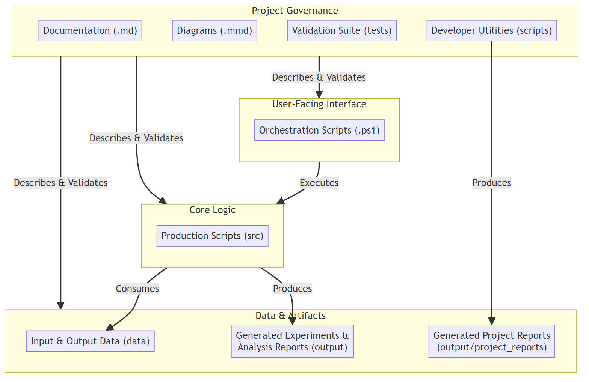

<!--
================================================================================
!!! DO NOT EDIT 'docs/DOCUMENTATION.md' DIRECTLY !!!

This file is automatically generated from the template:
/docs/DOCUMENTATION.template.md

To make changes, please edit the template file and then run 'pdm run build-docs'.
================================================================================
-->

# A Framework for Testing Complex Narrative Systems

This document is the **Framework Manual** for the project. It provides a comprehensive technical guide to the framework, which is designed for the resilient and reproducible testing of large-scale LLM experiments with complex narrative systems. It offers a fully automated, end-to-end pipeline that manages the entire experimental lifecycle, from data preparation and query generation to LLM interaction, response parsing, hierarchical data aggregation, and final statistical analysis.

This manual is intended for developers, contributors, and researchers who wish to understand the system's architecture or use the framework for several types of scientific validation, including **direct, methodological, and conceptual replication, as well as for new research**.

<div align="center">
  <p>Project Architecture: A high-level overview of the project's main functional components and their relationships.</p>
  
</div>

## Research Question
At its core, this project investigates whether a Large Language Model (LLM) can solve a complex matching task: given a set of sanitized, narrative personality descriptions (derived from birth data) and a corresponding set of general biographical profiles, can the LLM correctly pair them at a rate significantly greater than chance?

This study introduces a novel methodological twist to probe the limits of LLM pattern recognition. The link between the narrative descriptions and the biographical profiles is a faint, systematic signal generated by a deterministic, esoteric system (an astrology program). This transforms the experiment into a rigorous test of an LLM's ability to detect subtle, rule-based patterns within a noisy, high-dimensional dataset. The central question is not about the validity of the generating system, but about the capability of the AI to find a signal in its output.

## A Note on Stimulus Generation and Experimental Design
The experiment is built upon a custom database of 6,000 famous historical individuals, for whom accurate and verified birth data (date, time, place) was meticulously collected. This population was chosen for two reasons:

*   **Signal Integrity**: Accurate birth data ensures the deterministic generation of consistent personality narratives.
*   **Task Feasibility**: The public prominence of these individuals makes it plausible that LLMs have encountered their biographical information during training, making the matching task tractable.

To create a uniquely challenging test, we employed a multi-step, deterministic process to generate the textual stimuli:

1.  **Source & Score**: A `Raw Subject Database` of over 10,000 famous individuals was derived from the Astro-Databank (ADB). To ensure the selection process is robust, filtering relies on an LLM-generated **eminence score** for each candidate, created by the `generate_eminence_scores.py` script.
2.  **Determine Final Set**: A second script, `generate_ocean_scores.py`, processes subjects in order of eminence, generating OCEAN scores and stopping when personality diversity (measured by variance) shows a sustained drop. This data-driven cutoff determines the final number and list of subjects.
3.  **Calculation**: This final subject database was processed by a commercial astrology program (Solar Fire) to calculate the precise celestial positions for each person, which were exported into a `Names and Placements` data file.
4.  **Synthesis**: A custom Python script (`generate_personalities_db.py`) then processed this data. Using a `Neutralized Component Library` (a collection of pre-written, non-esoteric descriptive sentences), the script deterministically assembled a unique personality narrative for each individual.
    - The script's algorithm loads its core logic—point weights and balance thresholds—from external data files (`point_weights.csv`, `balance_thresholds.csv`). It uses these to calculate weighted scores for various astrological factors (elements, modes, quadrants, etc.) and classify them as 'strong' or 'weak' based on their prominence.
    - These classifications, along with simple placements, serve as keys to look up and combine the corresponding neutralized descriptions from the component library. **The script's algorithm has been rigorously validated against a ground-truth dataset generated by the source Solar Fire software, ensuring its output is bit-for-bit identical.**

The result is a clean dataset of personality profiles where the connection to an individual's biographical profile is systematic but non-obvious.

**Crucially, this study does not seek to validate astrology.** Instead, it treats the generating program as an arbitrary, complex algorithm. The scientific objective is to determine whether an LLM, a third-party pattern-recognition system, can detect the subtle statistical regularities produced by this algorithm and use them to perform a successful matching task. The findings speak to the profound capabilities of LLMs to find signal in noisy, high-dimensional data, regardless of the source's theoretical basis.

## Data Preparation Pipeline

The data preparation pipeline is a fully automated, multi-stage workflow. It begins with data extraction from the live Astro-Databank website and concludes with the generation of the final `personalities_db.txt` file used in the experiments.

**Replication Paths:** Researchers can approach this project in several ways to validate and extend the findings:

1.  **Direct Replication (Computational Reproducibility):** To verify that the framework produces the exact findings reported in the article, clone this repository and use the static data and randomization seeds as provided. This is a bit-for-bit validation of the original results.

2.  **Methodological Replication (Testing Robustness):** To validate that the findings are robust and not an artifact of a specific dataset or randomization seed, use the framework as-is but vary the inputs. This can be done in two ways:
    *   **With a New Dataset:** Run the full `prepare_data.ps1` pipeline to generate a fresh dataset from the live Astro-Databank. This tests the statistical robustness of the method on a new sample.
    *   **With New Randomization:** Use the provided static dataset but specify a different set of randomization seeds in `config.ini`. This validates the stability of the results across different random permutations.

3.  **Conceptual Replication (Extending the Research):** To test the underlying scientific concepts with an improved or modified method, researchers can alter the framework itself. This could involve using a different LLM, modifying the analysis scripts, or changing other core parameters to conduct new research built upon this study's foundation.

#### The Automated Workflow

The automated data preparation pipeline is orchestrated by a single, intelligent PowerShell script: `prepare_data.ps1`. This is the recommended method for both initial runs and for resuming interrupted processes.

**Execution:**
```powershell
# Run the entire data preparation pipeline interactively
.\prepare_data.ps1

# Get a read-only status report of the pipeline's progress
.\prepare_data.ps1 -ReportOnly
```
> **Note on Learning the Pipeline:** A step-by-step "guided tour" of this workflow is available as part of the project's testing harness. This is an excellent way for new users to learn how the pipeline works. See the **[🧪 Testing Guide (TESTING.md)](../TESTING.md)** for details on running the Layer 3 Interactive Mode.

The script is fully resumable. It automatically detects which steps have already been completed and picks up from the first missing data artifact, ensuring a smooth and efficient workflow.

#### Individual Script Details

The `prepare_data.ps1` script orchestrates a sequence of individual Python scripts followed by a manual processing step. The following is a detailed breakdown of this underlying workflow.

**Stage 1: Data Sourcing and Filtering (Automated)**

The initial stage of the pipeline is a two-step process designed to create a high-quality cohort of subjects. It combines source-level querying with post-processing filters.

1.  **Source-Level Filtering (`fetch_adb_data.py`):** This is the primary entry point. The script logs into the ADB website and queries its internal API using a specific set of pre-filters to ensure data quality and relevance. The query only includes subjects who meet all of the following criteria:

    -   **High-Quality Birth Data:** The record must have a Rodden Rating of 'A' or 'AA', indicating the birth time is from a reliable source.
    -   **Deceased Individuals:** The record must have a recorded death date. This is an ethical control to avoid processing data for living individuals.
    -   **Eminence:** The subject must belong to the specific nested category of **Notable > Famous > Top 5% of Profession** within the ADB, ensuring the sample consists of well-known public figures.

2.  **Post-Processing and Final Filtering (`select_eligible_candidates.py`):** After the initial dataset is fetched, this script performs a second, more detailed filtering pass. It integrates the raw data with the Wikipedia validation report and applies the following additional criteria in order:

    -   **Wikipedia Validation Status:** Only records with a `Status` of `OK` are kept, indicating that a valid English Wikipedia page was found where the subject's name and death date were confirmed.
    -   **Entry Type:** Only records with an `EntryType` of `Person` are kept, filtering out non-person records such as `Research` entries for events or unnamed individuals.
    -   **Birth Year Range:** The subject's birth year must be between 1900 and 1999, inclusive. This filter defines a single historical cohort to control for era-specific confounds and excludes a small number of post-1999 births, which represent only 0.6% of the raw dataset.
    -   **Valid Time Format:** The birth time must be present and in a valid `HH:MM` format.
    -   **Deduplication:** Duplicate entries are removed based on a combination of the subject's normalized name and their full birth date.
    -   **Hemisphere:** The subject's `Latitude` must contain the character 'N', ensuring only Northern Hemisphere births are included. This filter removes a small number of records (~5%) to control for the potential confounding variable of a 180-degree zodiacal shift for Southern Hemisphere births, which could introduce unnecessary noise to the dataset.
    
    The final output of this stage is the `adb_eligible_candidates.txt` file.

**Stage 2: Link Finding, Validation, and Scoring (Automated)**
This stage identifies the correct Wikipedia page for each subject, validates its content, and scores the candidates to ensure only high-quality subjects proceed.

3.  **Link Finding (`find_wikipedia_links.py`):** This script takes the raw ADB export and finds the best-guess English Wikipedia URL for each subject. It scrapes the ADB page and uses a Wikipedia search as a fallback. The output is an intermediate file, `adb_wiki_links.csv`.
4.  **Page Validation (`validate_wikipedia_pages.py`):** This script takes the list of found links and performs an intensive content validation on each page. It handles redirects, resolves disambiguation pages, validates the subject's name, and confirms their death date. The final output is the detailed `adb_validation_report.csv`.
5.  **Eminence Scoring (`generate_eminence_scores.py`):** Processes the eligible candidates list to generate a calibrated eminence score for each, producing a rank-ordered list that now includes `BirthYear`.
6.  **OCEAN Scoring & Cutoff (`generate_ocean_scores.py`):** A fully automated, resilient script that determines the final dataset size. It processes subjects by eminence and stops when diversity (variance) shows a sustained drop. Its robust pre-flight check re-analyzes existing data on startup, ensuring that interrupted runs can be safely resumed or correctly finalized without user intervention. The output also includes `BirthYear`.

**Stage 3: Final Subject Selection (Automated)**

7.  **Final Selection (`select_final_candidates.py`):** Performs the final filtering. It takes the eligible candidates list, selects only those present in the definitive `ocean_scores.csv` set, resolves country codes, and sorts the final list by eminence.

**Stage 4: Chart Calculation (Manual)**

8.  **Formatting (`prepare_sf_import.py`):** Formats the final subject list for import into the Solar Fire software, encoding each subject's unique ID for data integrity.
9.  **Manual Processing (Solar Fire):** The formatted file is imported into Solar Fire, which calculates the required celestial data and exports it as `sf_chart_export.csv`.

**Stage 5: Delineation Neutralization (Automated)**

10. **Neutralization (`neutralize_delineations.py`):** This script uses a powerful hybrid strategy to rewrite the esoteric source texts.
    *   **Fast Mode (`--fast`):** For initial runs, this mode bundles tasks into large, high-speed API calls (e.g., all 12 "Sun in Signs" delineations at once). This is highly efficient but may fail on some large tasks.
    *   **Robust/Resume Mode (default):** For resuming or fixing failed runs, this mode processes each of the 149 delineations as a separate, atomic task. This granular approach is slower but guarantees completion by solving potential response truncation issues from the LLM.

**Stage 6: Final Database Generation (Automated)**

11. **Integration (`create_subject_db.py`):** Integrates the manually generated chart data with the final subject list, decodes the unique IDs, and produces a clean master database.
12. **Generation (`generate_personalities_db.py`):** Assembles the final `personalities_db.txt` by combining the subject data with the neutralized delineation library according to a deterministic algorithm.

This combination of automated scripts and well-defined manual steps ensures the final dataset is both high-quality and computationally reproducible.

The pipeline can be understood through the following architecture, workflow, data flow, and logic diagrams.

### Data Preparation: Architecture

This diagram provides a map of the scripts in the data preparation pipeline, showing how they are orchestrated and which utilities they share.

<div align="center">
  <p>Data Preparation Code Architecture: The execution flow of the data processing scripts.</p>
  
</div>

### Data Preparation: Workflow

This diagram shows the high-level, multi-stage workflow for the entire data preparation pipeline, including both automated and manual processes.

<div align="center">
  <p>Data Preparation Workflow: The end-to-end pipeline from raw data extraction to the final generated databases, showing both manual and automated steps.</p>
  
</div>

### Data Preparation: Data Flow

These diagrams show the sequence of data artifacts (files) created and transformed by the pipeline scripts at each major stage.

<div align="center">
  <p>Data Prep Flow 1: Sourcing raw data and creating a validated list of eligible candidates.</p>
  
</div>

<div align="center">
  <p>Data Prep Flow 2: Scoring eligible candidates to determine the final, rank-ordered subject set.</p>
  
</div>

<div align="center">
  <p>Data Prep Flow 3: Generating the final personalities database from the subject set and neutralized text library.</p>
  
</div>

### Data Preparation: Logic

These diagrams illustrate the internal decision-making logic and control flow of each script in the data preparation pipeline.

<div align="center">
  <p>Overall Logic for the Data Preparation Pipeline: A high-level view of the key filtering, selection, and generation stages.</p>
  
</div>

<div align="center">
  <p>Logic for Link Finding (`find_wikipedia_links.py`): The algorithm for finding Wikipedia URLs by scraping ADB and using a Wikipedia search fallback.</p>
  
</div>

<div align="center">
  <p>Logic for Page Validation (`validate_wikipedia_pages.py`): The algorithm for validating Wikipedia page content, including redirect and disambiguation handling.</p>
  
</div>

<div align="center">
  <p>Logic for Eligibility Selection (`select_eligible_candidates.py`): The algorithm for performing initial data quality checks to create a pool of eligible candidates.</p>
  
</div>

<div align="center">
  <p>Logic for Eminence Scoring (`generate_eminence_scores.py`): The algorithm for batch processing, LLM interaction, and finalization of eminence scores.</p>
  
</div>

<div align="center">
  <p>Logic for OCEAN Scoring (`generate_ocean_scores.py`): The algorithm for generating OCEAN scores and determining the final dataset size. A robust pre-flight check re-analyzes all existing data to ensure correct resumption or finalization after interruptions.</p>
  
</div>

<div align="center">
  <p>Logic for Final Selection (`select_final_candidates.py`): The algorithm for filtering, transforming, and sorting the final subject set.</p>
  
</div>

<div align="center">
  <p>Logic for Delineation Neutralization (`neutralize_delineations.py`): The hybrid algorithm for rewriting texts. Fast mode bundles tasks for speed, while the robust default mode processes each item individually to guarantee completion.</p>
  
</div>

<div align="center">
  <p>Logic for Database Generation (`generate_personalities_db.py`): The algorithm for assembling the final description text for each subject.</p>
  
</div>

## Main Experiment & Analysis Pipeline

### Key Features

-   **Automated Batch Execution**: The `experiment_manager.py` script, driven by a simple PowerShell wrapper, manages entire experimental batches. It can run hundreds of replications, intelligently skipping completed ones to resume interrupted runs, and provides real-time progress updates, including a detailed spinner showing individual trial timers and overall replication batch ETA.
-   **Powerful Reprocessing Engine**: The manager's `--reprocess` mode allows for re-running the data processing and analysis stages on existing results without repeating expensive LLM calls. This makes it easy to apply analysis updates or bug fixes across an entire experiment.
-   **Guaranteed Reproducibility**: On every new run, the `config.ini` file is automatically archived in the run's output directory, permanently linking the results to the exact parameters that generated them.
-   **Standardized, Comprehensive Reporting**: Each replication produces a `replication_report.txt` file containing run parameters, status, a human-readable statistical summary, and a machine-parsable JSON block with all key metrics. This format is identical for new runs and reprocessed runs.
-   **Hierarchical Analysis & Aggregation**: The pipeline uses a set of dedicated compiler scripts for a fully auditable, bottom-up aggregation of results. `compile_replication_results.py` creates a summary for each run, `compile_experiment_results.py` combines those into an experiment-level summary, and finally `compile_study_results.py` creates a master `STUDY_results.csv` for the entire study.
-   **Resilient and Idempotent Operations**: The pipeline is designed for resilience. The `manage_experiment_log.py` script can `rebuild` experiment logs from scratch, and its `finalize` command is idempotent, ensuring that data summaries are always correct even after interruptions.
-   **Standardized Console Banners**: All audit results, whether for success, failure, or a required update, are now presented in a consistent, easy-to-read, 4-line colored banner, providing clear and unambiguous status reports.
-   **Streamlined ANOVA Workflow**: The final statistical analysis is a simple two-step process. `compile_study_results.py` prepares a master dataset, which `analyze_study_results.py` then automatically analyzes to generate tables and publication-quality plots using user-friendly display names defined in `config.ini`.

### Visual Architecture of the Main Pipeline

The main pipeline's architecture can be understood through four different views: the code architecture, the workflows, the data flow, and the experimental logic.

#### Code Architecture Diagram
The codebase for the main pipeline is organized into a clear hierarchy:

1.  **Main User Entry Points**: User-facing PowerShell scripts (`.ps1`) that orchestrate high-level workflows like creating, auditing, or fixing experiments and studies.
2.  **Experiment Lifecycle Management**: The core Python backend for managing a single experiment. This includes primary orchestrators (`experiment_manager.py`, `experiment_auditor.py`) and dedicated finalization scripts (`manage_experiment_log.py`, `compile_experiment_results.py`).
3.  **Single Replication Pipeline**: A set of scripts, managed by `replication_manager.py`, that execute the end-to-end process for a single run, from query generation to final reporting.
4.  **Study-Level Analysis**: Python scripts that operate on the outputs of multiple experiments to perform study-wide aggregation and statistical analysis.
5.  **Utility & Other Scripts**: Shared modules and standalone utility scripts that provide common functionality (e.g., `config_loader.py`) or perform auxiliary tasks.

<div align="center">
  <p>Codebase Architecture: A comprehensive map of the entire Python codebase. PowerShell scripts (blue) are user-facing entry points that execute core Python logic. Solid lines indicate execution, while dotted lines show module imports.</p>
  
</div>

#### Workflow Diagrams
The project's functionality is organized into six primary workflows, each initiated by a dedicated PowerShell script (Main User Entry Points):

1.  **Run an Experiment**: The most common action; used for starting a new experiment or resuming/healing an interrupted one.
2.  **Audit an Experiment**: Provides a read-only, detailed completeness report for an experiment, acting as the primary diagnostic tool.
3.  **Update an Experiment**: A specific action for existing experiments, used to reapply analysis or bug fixes without re-running expensive LLM calls.
4.  **Migrate Old Experiment Data**: A utility workflow designed to bring older, legacy experimental data into compliance with the modern pipeline.
5.  **Compile a Study**: The highest-level workflow, used after a study is validated to audit, compile, and analyze all data, producing the final reports and plots.
6.  **(Planned) Create a New Study**: A future workflow to automate the creation of an entire study by orchestrating multiple `new_experiment.ps1` runs based on a matrix of factors (e.g., models, mapping strategies).
7.  **Audit a Study**: Provides a consolidated, read-only audit of all experiments in a study to verify their readiness for final analysis.
8.  **Fix a Study**: The primary "fix-it" tool for a study. It audits all experiments and automatically calls `fix_experiment.ps1` on any that need to be resumed, repaired, or updated.
9.  **Migrate a Study**: A batch utility for safely upgrading legacy or corrupted experiments. It audits the study and calls `migrate_experiment.ps1` on any experiments that require it.

#### Workflow 1: Create a New Experiment

This is the primary workflow for generating new experimental data. The PowerShell entry point (`new_experiment.ps1`) calls the Python batch controller (`experiment_manager.py`). The manager creates a new, timestamped directory and runs the full set of replications from scratch.

The `replication_manager.py` script executes the full pipeline for a single run, which is broken into six distinct stages:

1.  **Build Queries**: Generates all necessary query files and trial manifests.
2.  **Run LLM Sessions**: Interacts with the LLM API in parallel to get responses.
3.  **Process LLM Responses**: Parses the raw text responses from the LLM into structured score files.
4.  **Analyze LLM Performance**: A unified two-part process that first calculates core performance metrics and then injects diagnostic bias metrics.
5.  **Generate Final Report**: Assembles the final `replication_report.txt` from the analysis results and captured logs.
6.  **Create Replication Summary**: Creates the final `REPLICATION_results.csv`, marking the run as valid.

<div align="center">
  <p>Workflow 1: Create a New Experiment, showing the main control loop and the internal replication pipeline.</p>
  
</div>

#### Workflow 2: Audit an Experiment

This workflow provides a read-only, detailed completeness report for an experiment without performing any modifications. The `audit_experiment.ps1` wrapper calls the dedicated `experiment_auditor.py` script. The full audit report, including subprocess outputs, is also saved to `experiment_audit_log.txt` within the audited directory.

<div align="center">
  <p>Workflow 2: Audit an Experiment. Provides a read-only, detailed completeness report for an experiment.</p>
  
</div>

##### Interpreting the Audit Report
The audit script is the primary diagnostic tool for identifying issues in a failed or incomplete experiment. It uses a simple but robust rule to classify problems: the number of distinct errors found in a single replication run.

**Repairable Issues (Single Error)**
If a replication run has **exactly one** identifiable problem, it is considered safe to repair in-place. The `Status` column will show a specific, targeted error code:

*   **`INVALID_NAME`**: The run directory name is malformed.
*   **`CONFIG_ISSUE`**: The `config.ini.archived` file is missing or has inconsistent parameters.
*   **`QUERY_ISSUE`**: Core query files or manifests are missing.
*   **`RESPONSE_ISSUE`**: One or more LLM response files are missing.
*   **`ANALYSIS_ISSUE`**: All core data is present, but derivative analysis files or reports are missing/outdated.

Any of these single-error states will result in an overall audit recommendation to run **`fix_experiment.ps1`**.

**Corrupted Runs (Multiple Errors)**
If a replication run has **two or more** distinct problems (e.g., a missing config file *and* missing responses), it is flagged with the status `RUN_CORRUPTED`. The presence of even one corrupted run suggests a systemic issue that is safer to handle with a non-destructive copy-and-upgrade workflow. The overall audit will recommend running **`migrate_experiment.ps1`** to create a clean, repaired copy of the experiment.

The `Details` string provides a semicolon-separated list of all detected issues (e.g., `CONFIG_MISSING; RESPONSE_FILES_INCOMPLETE`).

In addition to the per-replication table, the audit provides an `Overall Summary` that includes the `Experiment Aggregation Status`. This checks for the presence and completeness of top-level summary files (`EXPERIMENT_results.csv`, `experiment_log.csv`), confirming whether the last aggregation step for the experiment was successfully completed.

#### Workflow 3: Fixing or Updating an Experiment

This workflow is the main "fix-it" tool for any existing experiment. The `fix_experiment.ps1` script is an intelligent wrapper. It first performs a full audit by calling `experiment_auditor.py` to diagnose the experiment's state. Based on the audit result, it then calls `experiment_manager.py` to apply the correct repairs.

-   If the audit finds missing data or outdated analysis files, the script proceeds to automatically apply the correct repair.
-   If the audit finds the experiment is already complete and valid, it becomes interactive, presenting a menu that allows the user to force a full data repair, an analysis update, or a simple re-aggregation of results.

<div align="center">
  <p>Workflow 3: Fixing or Updating an Experiment, showing both automatic and interactive repair paths.</p>
  
</div>

#### Workflow 4: Migrate Old Experiment Data

This utility workflow provides a safe, non-destructive process to upgrade older experimental data into the current pipeline's format, leaving the original data untouched. The `migrate_experiment.ps1` script orchestrates a clear, four-step process:

1.  **Audit Target**: A read-only audit is performed on the target directory by `experiment_auditor.py` to assess its state.
2.  **Copy Data**: After user confirmation, the script creates a clean, timestamped copy of the target experiment in the `output/migrated_experiments/` directory.
3.  **Upgrade Copy**: The script calls `experiment_manager.py --migrate` on the new copy. This manager automates the entire upgrade, which consists of a *preprocessing* phase (cleaning old artifacts, patching configs, reprocessing all runs) and a *finalizing* phase (generating all modern summary files).
4.  **Final Validation**: The wrapper script runs a final read-only audit on the newly upgraded experiment, providing explicit confirmation that the process was successful.

<div align="center">
  <p>Workflow 4: Migrate Old Experiment Data, a safe, non-destructive process for upgrading legacy data.</p>
  
</div>

#### Workflow 5: Compile a Study

This workflow is used after all experiments are validated to compile, analyze, and evaluate the entire study. It performs a robust pre-flight check by calling `audit_study.ps1`. If the study is not ready for processing (or is already complete), it will halt with a clear recommendation. Otherwise, it proceeds to compile all results and run the final statistical analysis.

<div align="center">
  <p>Workflow 5: Compile a Study. Audits, compiles, and analyzes all experiments in a study.</p>
  
</div>

#### Workflow 6: (Planned) Create a New Study
This workflow is a planned feature. It will provide a top-level script (`new_study.ps1`) to automate the creation of entire studies. It will be designed to read a matrix of factors to vary from `config.ini` (e.g., a list of models and mapping strategies) and then orchestrate the entire process by calling `new_experiment.ps1` for each required experiment.

<div align="center">
  
</div>

#### Workflow 7: Audit a Study

This script is the primary diagnostic tool for assessing the overall state of a study. It performs a two-part, read-only audit:

1.  **Readiness Audit**: It iterates through every experiment folder and runs a quiet, individual audit on each to determine its status (e.g., `VALIDATED`, `NEEDS REPAIR`).
2.  **Completeness Audit**: It verifies the existence of top-level study artifacts, such as `STUDY_results.csv` and the `anova/` analysis directory.

Based on the combined results from both audits, it presents a consolidated summary table and provides a final, context-aware recommendation for the correct next step.

<div align="center">
  <p>Workflow 7: Audit a Study. Consolidated completeness report for all experiments in a study.</p>
  
</div>

#### Workflow 8: Fix a Study

This is the main "fix-it" tool for an entire study. It first runs a comprehensive audit to identify all experiments that need to be resumed, repaired, or updated. It will halt if any experiments require migration. Otherwise, it prompts for confirmation and then automatically calls `fix_experiment.ps1` on each experiment that needs attention.

<div align="center">
  <p>Workflow 8: Fix a Study. A batch operation to fix all repairable experiments in a study.</p>
  
</div>

#### Workflow 9: Migrate a Study

This is a batch utility workflow for safely upgrading an entire study that contains legacy or corrupted experiments. It first runs an audit to identify which experiments require migration. It will halt if any experiments have simple repairable issues, ensuring migrations are performed on an otherwise stable study. After confirmation, it automatically calls `migrate_experiment.ps1` on each required experiment.

<div align="center">
  <p>Workflow 9: Migrate a Study. A batch operation to upgrade all legacy experiments in a study.</p>
  
</div>


#### Data Flow Diagram

This diagram shows how data artifacts (files) are created and transformed by the main pipeline scripts. It traces the flow from initial inputs like `config.ini` and the personalities database, through intermediate query and response files, to the final aggregated results and analysis plots.

<div align="center">
  <p>Data Flow Diagram: Creation and transformation of data artifacts (files) by the main pipeline scripts.</p>
  
</div>

#### Logic Flowcharts

These diagrams illustrate the scientific and procedural methodology at each level of the experimental hierarchy.

<div align="center">
  <p>Replication Logic: The scientific methodology for a single replication run.</p>
  
</div>

<div align="center">
  <p>Experiment Logic: The aggregation of multiple replication results to produce final experiment-level summaries.</p>
  
</div>

<div align="center">
  <p>Study Logic: The complete workflow for processing a study, from auditing and aggregation to final statistical analysis.</p>
  
</div>

## Experimental Hierarchy

The project's experiments are organized in a logical hierarchy:

-   **Study**: The highest-level grouping, representing a major research question (e.g., "Performance on Random vs. Correct Mappings").
-   **Experiment**: A complete set of runs for a single condition within a study (e.g., "Gemini 2.0 Flash with k=10 Subjects").
-   **Replication**: A single, complete run of an experiment, typically repeated 30 times for statistical power.
-   **Trial**: An individual matching task performed within a replication, typically repeated 100 times.

## Directory Structure

This logical hierarchy is reflected in the physical layout of the repository:

<div align="center">
  
</div>

A `data/README.md` file provides detailed explanations for each file in the `data/` directory.

## Setup and Installation

This project uses **PDM** for dependency and environment management.

1.  **Install PDM (One-Time Setup)**:
    If you don't have PDM, install it once with pip. It's best to run this from a terminal *outside* of any virtual environment.
    ```bash
    pip install --user pdm
    ```
    > **Note:** If `pdm` is not found in a new terminal, use `python -m pdm` instead.

2.  **Install Project Environment & Dependencies**:
    From the project's root directory, run the main PDM installation command. The `-G dev` flag installs all packages, including the development tools needed to run the test suite.
    ```bash
    pdm install -G dev
    ```
    This command creates a local `.venv` folder and installs all necessary packages into it.

3.  **Configure API Key**:
    *   Create a file named `.env` in the project root.
    *   Add your API key from OpenRouter. The key will start with `sk-or-`.
        `OPENROUTER_API_KEY=your-actual-api-key`

To run any project command, such as the test suite, prefix it with `pdm run`:
```bash
pdm run test
```

> **For Developers:** If you intend to contribute to the project or encounter issues with the simple setup, please see the **[Developer Setup Guide in CONTRIBUTING.md](CONTRIBUTING.md#getting-started-development-environment-setup)** for more detailed instructions and troubleshooting.

## Configuration (`config.ini`)

The `config.ini` file is the central hub for defining all parameters for your experiments. The pipeline automatically archives this file with the results for guaranteed reproducibility.

### Display Name Settings

-   **`[ModelDisplayNames]`**: Maps a model's API identifier to a friendly, human-readable name for plots and reports (e.g., `meta-llama/llama-3-70b-instruct = Llama 3 70B Instruct`).
-   **`[FactorDisplayNames]`**: Maps factor names to plot labels (e.g., `mapping_strategy = Mapping Strategy`).
-   **`[MetricDisplayNames]`**: Maps metric names to plot titles (e.g., `mean_mrr = Mean Reciprocal Rank (MRR)`).

### Experiment Settings (`[Study]`)

-   **`num_replications`**: The number of times the experiment will be repeated (e.g., `30`).
-   **`mapping_strategy`**: A key experimental variable. Can be `correct` or `random`.

### LLM Settings (`[LLM]`)

-   **`model_name`**: The API identifier for the LLM to be tested (e.g., from a provider like OpenRouter: `google/gemini-flash-1.5`).
-   **`temperature`**: Controls the randomness of the model's output. A lower value (e.g., `0.2`) makes the output more deterministic and focused, while a higher value (e.g., `0.8`) encourages more creative responses.
-   **`max_tokens`**: The maximum number of tokens the model is allowed to generate in its response. This acts as a safeguard against overly long or runaway outputs.
-   **`max_parallel_sessions`**: The maximum number of concurrent API calls to make. Increasing this can speed up experiments but may encounter API rate limits.

#### Model Selection Philosophy and Future Work
The selection of models for this study was guided by a balance of performance, cost, speed, and technical compatibility with the automated framework. Several top-tier models were not included for one of the following reasons:

-   **Prohibitive Cost**: Models like `o1 pro`, `GPT 4.5 Preview`, and `Claude 4 Opus` were excluded as a single experiment (requiring ~3,000 queries) was financially infeasible.

-   **Technical Incompatibility**: Models like `Gemini 2.5 Pro` lacked a "non-thinking" mode, making the automated parsing of a structured response table overly challenging.

-   **Excessive Runtime**: A number of large models, including `Qwen3 235B` and `Llama 3.1 Nemotron Ultra 253B`, were excluded as a full experimental run would take longer than 20 hours.

A follow-up study is planned to evaluate other powerful, medium-cost models as API costs decrease and technical features evolve. Candidates include: `Grok 3`, `Grok 4`, `Claude 4 Sonnet`, `Claude 3.7 Sonnet`, `GPT-4o`, `o3`, `GPT-4.1`, `Mistral Large 2`, `Gemini 1.5 Pro`, and various `o1`/`o3`/`o4` mini-variants.

### Analysis Settings (`[Analysis]`)

-   **`min_valid_response_threshold`**: Minimum average number of valid responses (`n_valid_responses`) for an experiment to be included in the final analysis. Set to `0` to disable.

## Known Issues and Future Work

This framework is under active development. For a detailed and up-to-date list of planned improvements, known issues, and future development tasks, please see the [Project Roadmap](ROADMAP.md).

## Choosing the Right Workflow: Separation of Concerns

The framework is designed around a clear "Create -> Check -> Fix" model, with dedicated scripts for both individual experiments and entire studies. This separation of concerns ensures that each workflow is simple, predictable, and safe.

### For a Single Experiment

<div align="center">
  <p>Choosing the Right Workflow: A guide for single-experiment tasks.</p>
  
</div>

### For an Entire Study

<div align="center">
  <p>Choosing the Right Workflow: A guide for study-level tasks.</p>
  
</div>

-   **`new_experiment.ps1` (Create)**: Use this to create a new experiment from scratch. It runs the full pipeline and concludes with a final verification audit.

-   **`audit_experiment.ps1` (Check)**: Use this read-only tool to get a detailed status report on any existing experiment. It is your primary diagnostic tool and will recommend the correct next step.

-   **`fix_experiment.ps1` (Fix & Update)**: Use this for any experiment with a **single, fixable error**. It is the main "fix-it" tool for common issues like resuming an interrupted run or applying analysis updates. It concludes with a final verification audit.

-   **`migrate_experiment.ps1` (Upgrade)**: Use this powerful safety utility for any **legacy or severely corrupted experiment** (i.e., one with multiple errors per run). It performs a non-destructive upgrade by creating a clean copy of the experiment and running the full repair and validation process on it, leaving the original data untouched.

## Core Workflows

The project is orchestrated by several PowerShell wrapper scripts that handle distinct user workflows, from running new experiments to analyzing and migrating data.

### Creating a New Experiment (`new_experiment.ps1`)

This is the entry point for creating a new experiment from scratch. It reads `config.ini`, generates a timestamped directory, and runs the full batch.

```powershell
# Create and run a new experiment
.\new_experiment.ps1 -Verbose
```

### Auditing an Experiment (`audit_experiment.ps1`)

This is the primary diagnostic tool. It performs a read-only check and provides a detailed status report for the specified experiment.

```powershell
# Get a status report for an existing experiment
.\audit_experiment.ps1 -ExperimentDirectory "output/new_experiments/experiment_20250727_143214"
```

### Fixing or Updating an Experiment (`fix_experiment.ps1`)

This is the main "fix-it" tool for any existing experiment. It automatically diagnoses and fixes issues.

**To automatically fix a broken or incomplete experiment:**
The script will run an audit, identify the problem (e.g., missing responses, outdated analysis), and automatically apply the correct fix.
```powershell
# Automatically fix a broken experiment
.\fix_experiment.ps1 -ExperimentDirectory "output/new_experiments/experiment_20250727_143214"
```

**To interactively force an action on a valid experiment:**
If you run the script on a complete and valid experiment, it will present an interactive menu allowing you to force one of three actions:

*   **Full Repair**: A destructive action that deletes all LLM responses and re-runs all API calls.
*   **Full Update**: A safe and quick action that re-runs only the analysis and reporting stages on existing data.
*   **Aggregation Only**: The fastest action, which re-creates only the top-level experiment summary files (`EXPERIMENT_results.csv`, `experiment_log.csv`).

```powershell
# Run on a valid experiment to bring up the interactive force menu
.\fix_experiment.ps1 -ExperimentDirectory "output/new_experiments/experiment_20250727_143214"
```

### Migrating Old Experiment Data (`migrate_experiment.ps1`)

This script provides a safe, non-destructive workflow to upgrade older, legacy experiment directories to be compatible with the current analysis pipeline. The original data is always preserved. While its primary purpose is to upgrade legacy data, it can also be interactively run on a valid, modern experiment to force a full copy-and-reprocess, which can be useful for creating a modified duplicate of an experiment.

**What it does:**
The `migrate_experiment.ps1` script automates a copy-then-migrate process:

1.  **Copy**: It takes a source directory and copies it to a new, timestamped folder inside `output/migrated_experiments/`.
2.  **Migrate**: It then calls `experiment_manager.py --migrate` on this new directory. The manager orchestrates the internal upgrade steps:
    *   **Patching Configs**: The `upgrade_legacy_experiment.py` script is called to scan for runs missing a `config.ini.archived` file. For each one it finds, it calls the `restore_experiment_config.py` utility, which reverse-engineers the `replication_report.txt` to create the missing config file.
    *   **Rebuilding Reports**: Regenerating all reports into the modern format.
    *   **Finalizing**: Generating clean, modern summary files for the migrated experiment.

This approach leaves the original data completely untouched.

**How to use it:**
Point the script at the target directory of the experiment you want to migrate. The script will automatically create a timestamped destination folder for the upgraded copy.

```powershell
# Target "Legacy_Experiment_1" for migration, saving the result to a new timestamped folder.
.\migrate_experiment.ps1 -ExperimentDirectory "output/legacy/Legacy_Experiment_1"
```

### Auditing a Study (`audit_study.ps1`)

This is the main diagnostic tool for a study. It performs a comprehensive, two-part, read-only audit and provides a consolidated summary report with a final recommendation.

1.  **Readiness Audit**: Checks each experiment to determine its status (e.g., `VALIDATED`, `NEEDS REPAIR`).
2.  **Completeness Audit**: If all experiments are ready, it then checks for the final study-level artifacts (`STUDY_results.csv`, `anova/boxplots/`, etc.) to determine if the study has already been processed.

```powershell
# Get a status report for an entire study
.\audit_study.ps1 -StudyDirectory "output/studies/My_First_Study"
```

### Fixing a Study (`fix_study.ps1`)

This is the main "fix-it" tool for a study. It audits the study and automatically calls `fix_experiment.ps1` on any experiment that needs to be resumed, repaired, or updated. It will halt with an error if any experiments require migration, ensuring it only operates on repairable issues.

```powershell
# Automatically fix all repairable experiments in a study
.\fix_study.ps1 -StudyDirectory "output/studies/My_Broken_Study"
```

### Migrating a Study (`migrate_study.ps1`)

This script provides a safe, batch-migration workflow for a study containing legacy or corrupted experiments. It audits the study and automatically calls `migrate_experiment.ps1` on each experiment that requires it. It will halt with an error if any experiments have simple repairable issues, ensuring migrations are only run on a stable study.

```powershell
# Automatically migrate all legacy experiments in a study
.\migrate_study.ps1 -StudyDirectory "output/studies/My_Legacy_Study"
```

### Compiling a Study (`compile_study.ps1`)

This script orchestrates the entire compilation and analysis workflow for a study. It audits, compiles, and performs the final statistical analysis on all experiments.

**Important:** This script begins with a robust pre-flight check by calling `audit_study.ps1`. If the audit reveals that any experiment is not `VALIDATED`, or that the study is already `COMPLETE`, the process will halt with a detailed report and a clear recommendation. This guarantees that analysis is only performed on a complete and ready set of data.

For organizational purposes, one would typically move all experiment folders belonging to a single study into a common directory (e.g., `output/studies/My_First_Study/`).

**To run the compilation and analysis:**
Point the script at the top-level directory containing all relevant experiment folders. It will provide a clean, high-level summary of its progress.

```powershell
# Example: Compile and analyze all experiments in the "My_First_Study" directory
.\compile_study.ps1 -StudyDirectory "output/studies/My_First_Study"
```
For detailed, real-time logs, add the `-Verbose` switch.

**Final Artifacts:**
The script generates two key outputs:

1.  A master `STUDY_results.csv` file in your study directory, containing the aggregated data from all experiments.
2.  A new `anova/` subdirectory containing the final analysis:
    *   `STUDY_analysis_log.txt`: A comprehensive text report of the statistical findings.
    *   `boxplots/`: Publication-quality plots visualizing the results.
    *   `diagnostics/`: Q-Q plots for checking statistical assumptions.

---

## Standardized Output

The pipeline generates a consistent, standardized `replication_report.txt` for every run, whether it's a new, an updated (reprocessed), or migrated experiment. This ensures that all output is easily comparable and machine-parsable.

### Replication Report Format

Each report contains a clear header, the base query used, a human-readable analysis summary, and a machine-readable JSON block with all calculated metrics.

<div align="center">
  
</div>

**Date Handling by Mode:**

-   **Normal Mode**: The report title is `REPLICATION RUN REPORT` and the `Date` field shows the time of the original run.
-   **`--reprocess` Mode**: The report title is `REPLICATION RUN REPORT (YYYY-MM-DD HH:MM:SS)` with the reprocessing timestamp. The `Date` field continues to show the time of the **original** run for clear traceability.

### Study Analysis Log Format

The final analysis script (`analyze_study_results.py`) produces a comprehensive log file detailing the full statistical analysis of the entire study. The report is structured by metric, with each section providing descriptive statistics, the ANOVA summary, post-hoc results (if applicable), and performance groupings.

<div align="center">
  
</div>

---

## Key Data Formats

This section provides a reference for the structure of the most important data files used and generated by the framework.

### Primary Data Source

<div align="center">
  
</div>

### Manual Process I/O

<div align="center">
  
</div>

### Core Integrated & Final Databases

<div align="center">
  
</div>

<div align="center">
  
</div>

### Algorithm Configuration & Text Libraries

<div align="center">
  
</div>

<div align="center">
  
</div>

<div align="center">
  
</div>

<div align="center">
  
</div>

### Intermediate Data Artifacts

<div align="center">
  
</div>

<div align="center">
  
</div>

<div align="center">
  
</div>

<div align="center">
  
</div>

<div align="center">
  
</div>

<div align="center">
  
</div>

<div align="center">
  
</div>

---

## Testing

The project includes a comprehensive test suite managed by PDM scripts, which provides shortcuts for running tests with and without code coverage.

### Automated CI Checks

The project uses a GitHub Actions workflow for Continuous Integration (CI). On every push or pull request, it automatically runs a series of checks on Windows, Linux, and macOS to ensure code quality and consistency. This includes:

-   Linting all source files for correct formatting and headers.
-   Verifying that the documentation is up-to-date.

This ensures that the main branch is always stable and that all contributions adhere to the project's standards.

### Running the Test Suite

-   **To run all tests (Python and PowerShell) at once:**
    ```bash
    pdm run test
    ```
-   **To run only the PowerShell script tests:**
    ```bash
    pdm run test-ps-all
    ```
    You can also test individual PowerShell scripts (e.g., `pdm run test-ps-exp`, `pdm run test-ps-stu`).

### Code Coverage

The test suite is configured for detailed code coverage analysis using the `coverage` package.

-   **To run all tests and view a coverage report in the console:**
    ```bash
    pdm run cov
    ```
-   **To generate a detailed HTML coverage report (saved to `htmlcov/`):**
    ```bash
    pdm run cov-html
    ```
    Open `htmlcov/index.html` in your browser to explore the report.
