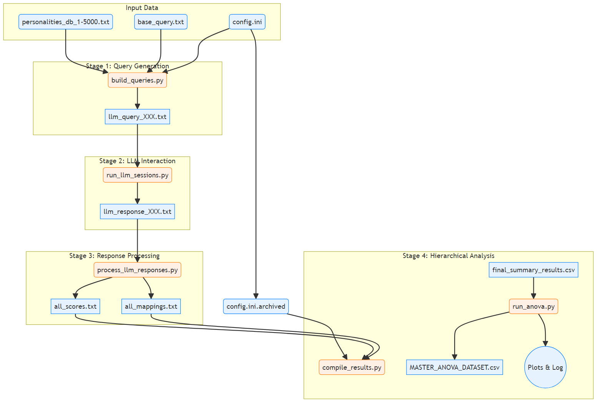
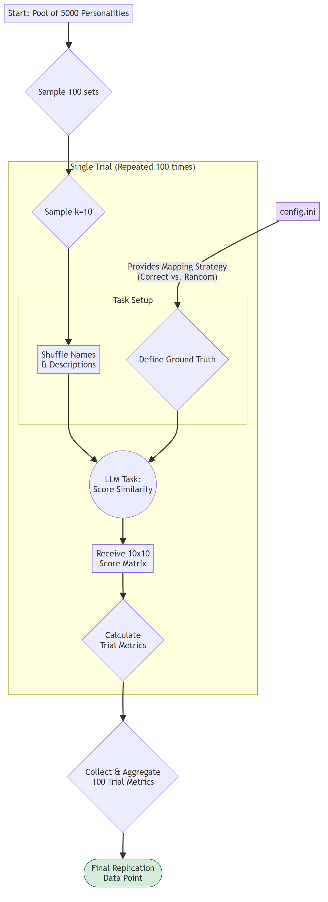
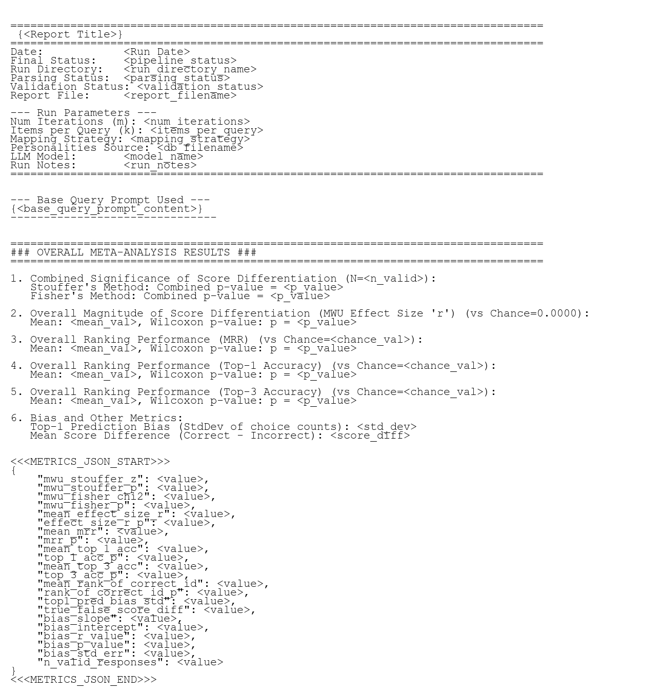
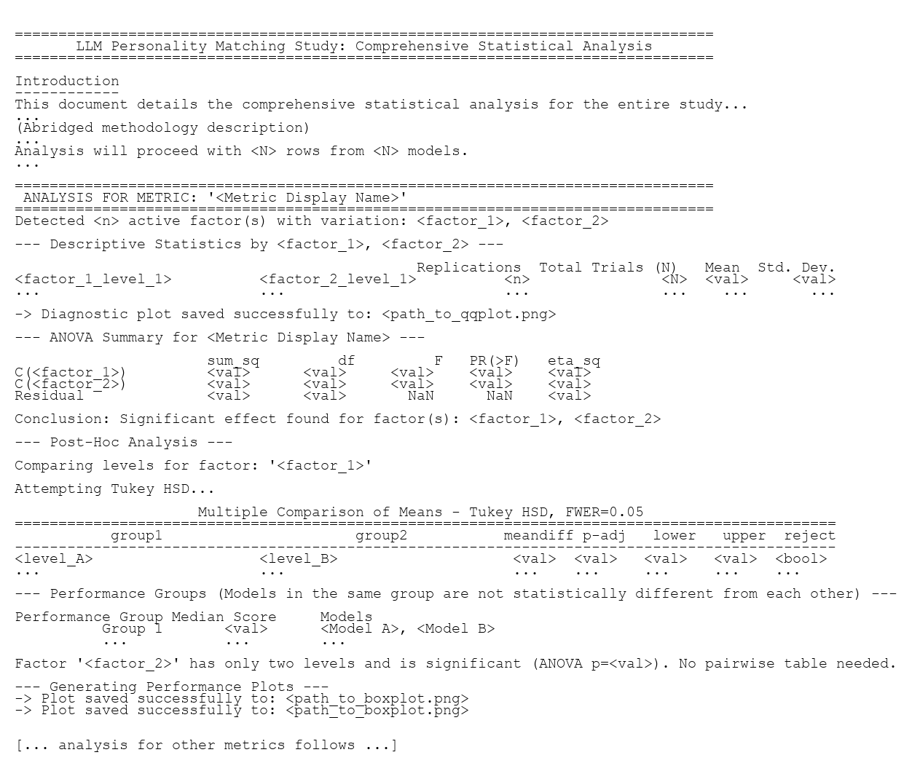

<!-- 
!! DO NOT EDIT THIS FILE DIRECTLY !!
This is the template for docs/DOCUMENTATION.md.
To make changes, edit this file and then run 'pdm run build-docs'.
-->

# A Resilient Framework for Large-Scale LLM Experimentation

This project provides a fully automated, resilient, and reproducible framework for conducting large-scale LLM experiments. It offers an end-to-end pipeline that manages the entire experimental lifecycle, from data preparation and query generation to LLM interaction, response parsing, hierarchical data aggregation, and final statistical analysis.

While the framework is modular and adaptable, its primary application here is to test an LLM's ability to solve a complex "who's who" personality matching task. It is ideal for researchers investigating LLM capabilities and developers who need a robust system for managing and analyzing automated experiments.

## Research Question
At its core, this project investigates whether a Large Language Model (LLM) can solve a complex matching task: given a set of sanitized, narrative personality descriptions (derived from birth data) and a corresponding set of general biographical profiles, can the LLM correctly pair them at a rate significantly greater than chance?

This study introduces a novel methodological twist to probe the limits of LLM pattern recognition. The link between the narrative descriptions and the biographical profiles is a faint, systematic signal generated by a deterministic, esoteric system (an astrology program). This transforms the experiment into a rigorous test of an LLM's ability to detect subtle, rule-based patterns within a noisy, high-dimensional dataset. The central question is not about the validity of the generating system, but about the capability of the AI to find a signal in its output.

## A Note on Stimulus Generation and Experimental Design
The experiment is built upon a custom database of 5,000 famous historical individuals, for whom accurate and verified birth data (date, time, place) was meticulously collected. This population was chosen for two reasons:

*   **Signal Integrity**: Accurate birth data ensures the deterministic generation of consistent personality narratives.
*   **Task Feasibility**: The public prominence of these individuals makes it plausible that LLMs have encountered their biographical information during training, making the matching task tractable.

To create a uniquely challenging test, we employed a two-step process to generate textual stimuli for each trial:

1.  **Generation**: A commercial astrology program was used as a "black box" function to deterministically map an individual's birth data to a narrative description. The generation was intentionally constrained to a foundational subset of the algorithm's rules (e.g., categorical placements and dominances), creating a signal of limited complexity.
2.  **Sanitization**: An LLM was then used to programmatically rewrite these descriptions, removing all explicit references to astrology, planets, or other esoteric terms.

The result is a clean dataset of personality profiles where the connection to the individual's biographical profile is systematic but non-obvious.

**Crucially, this study does not seek to validate astrology.** Instead, it treats the generating program as an arbitrary, complex algorithm. The scientific objective is to determine whether an LLM, a third-party pattern-recognition system, can detect the subtle statistical regularities produced by this algorithm and use them to perform a successful matching task. The findings speak to the profound capabilities of LLMs to find signal in noisy, high-dimensional data, regardless of the source's theoretical basis.

## Key Features

-   **Automated Batch Execution**: The `experiment_manager.py` script, driven by a simple PowerShell wrapper, manages entire experimental batches. It can run hundreds of replications, intelligently skipping completed ones to resume interrupted runs, and provides real-time ETA updates.
-   **Powerful Reprocessing Engine**: The manager's `--reprocess` mode allows for re-running the data processing and analysis stages on existing results without repeating expensive LLM calls. This makes it easy to apply analysis updates or bug fixes across an entire experiment.
-   **Guaranteed Reproducibility**: On every new run, the `config.ini` file is automatically archived in the run's output directory, permanently linking the results to the exact parameters that generated them.
-   **Standardized, Comprehensive Reporting**: Each replication produces a `replication_report.txt` file containing run parameters, status, a human-readable statistical summary, and a machine-parsable JSON block with all key metrics. This format is identical for new runs and reprocessed runs.
-   **Hierarchical Analysis & Aggregation**: The `experiment_aggregator.py` script performs a bottom-up aggregation of all data, generating level-aware summary files (`REPLICATION_results.csv`, `EXPERIMENT_results.csv`, and a master `STUDY_results.csv`) for a fully auditable research archive.
-   **Resilient and Idempotent Operations**: The pipeline is designed for resilience. The `replication_log_manager.py` script can `rebuild` experiment logs from scratch, and its `finalize` command is idempotent, ensuring that data summaries are always correct even after interruptions.
-   **Streamlined ANOVA Workflow**: The final statistical analysis is a simple two-step process. `experiment_aggregator.py` prepares a master dataset, which `study_analysis.py` then automatically analyzes to generate tables and publication-quality plots using user-friendly display names defined in `config.ini`.

## Visual Architecture

The project's architecture can be understood through four different views: the code architecture, the workflows, the data flow, and the experimental logic.

### Code Architecture Diagrams
The codebase can be divided into the following components:

1.  **Main User Entry Points**: The PowerShell scripts that users directly execute to initiate various workflows (e.g., `run_experiment.ps1`, `analyze_study.ps1`).

2.  **Experiment Lifecycle**: Python scripts primarily responsible for conducting a single experiment, including query generation, LLM interaction, response processing, and performance analysis.

3.  **Data Migration Processes**: Utility scripts used specifically for updating and cleaning older experiment data to ensure compatibility with the current analysis pipeline.

4.  **Study-Level Analysis**: Python scripts that aggregate results from multiple experiments and perform comprehensive statistical analysis for an entire study.

5.  **Shared Utilities**: Helper scripts and modules, like `config_loader.py`, that provide common functionality and are imported by multiple other scripts across different workflows.

#### Codebase Architecture
This diagram provides a comprehensive map of the entire Python codebase, showing how scripts execute (solid lines) or import (dotted lines) one another.

<div align="center">
  
</div>

### Workflow Diagrams
The project's functionality is organized into five primary workflows, each initiated by a dedicated PowerShell script (Main User Entry Points):

1.  **Run an Experiment**: The most common action; used for starting a new experiment or resuming/healing an interrupted one.

2.  **Audit an Experiment**: Provides a read-only, detailed completeness report for an experiment, acting as the primary diagnostic tool.

3.  **Update an Experiment**: A specific action for existing experiments, used to reapply analysis or bug fixes without re-running expensive LLM calls.

4.  **Migrate Old Experiment Data**: A utility workflow designed to bring older, legacy experimental data into compliance with the modern pipeline.

5.  **Analyze a Study**: The highest-level analytical tool, used after one or more experiments are complete to aggregate results across multiple experiments and perform comprehensive statistical analysis.

#### Workflow 1: Run an Experiment

This is the primary workflow for generating new experimental data. The PowerShell entry point (`run_experiment.ps1`) calls the Python batch controller (`experiment_manager.py`), which in turn executes a loop of single replications using `orchestrate_replication.py`.

Each replication executes the four core pipeline stages in sequence:

1.  **Query Generation**: `orchestrate_replication.py` first calls `build_llm_queries.py`. This script samples personalities from the master database (without replacement) and orchestrates the `query_generator.py` worker to create the prompt, a ground-truth mapping, and an audit manifest for each trial.

2.  **LLM Interaction**: Next, `run_llm_sessions.py` is called. It manages sending each generated query to the LLM via the `llm_prompter.py` worker and saves the responses.

3.  **Response Processing**: `process_llm_responses.py` parses the raw text responses from the LLM into a structured table of similarity scores.

4.  **Performance Analysis**: Finally, `analyze_llm_performance.py` performs the final statistical analysis for the replication. It calculates key metrics (MRR, Top-1 Accuracy, effect size), uses non-parametric tests to assess significance against chance, and embeds a comprehensive JSON summary of the results into the final report.

<div align="center">
  
</div>

#### Workflow 2: Audit an Experiment

This workflow provides a read-only, detailed completeness report for an experiment without performing any modifications. The `audit_experiment.ps1` wrapper calls `experiment_manager.py` with the `--verify-only` flag. The full audit report, including subprocess outputs, is also saved to `audit_log.txt` within the audited directory.

<div align="center">
  
</div>

##### Interpreting the Audit Report
The audit script is the primary diagnostic tool for identifying issues in a failed or incomplete experiment. It outputs a summary table with a high-level status for each replication run. The `Details` column provides granular error codes that pinpoint the exact problem. The final `Audit Result` and `Recommendation` suggest the next steps, if any.

**VALIDATED**  
The run is complete and all checks passed. No action is needed.

**INVALID_NAME**  
The run directory name is malformed and does not match the required `run_*_sbj-NN_trl-NNN` pattern. The folder must be renamed or repaired via a `run_experiment.ps1` initiated process.

**CONFIG_ISSUE**  
The run's `config.ini.archived` is missing, corrupted, or lacks required keys. This typically indicates a legacy experiment requiring **migration**.

**QUERY_ISSUE**  
There is a problem with the fundamental input files needed for an LLM session, such as missing query files or trial manifests. This requires **repair** by running `run_experiment.ps1` (or `migrate_experiment.ps1` if legacy).

**RESPONSE_ISSUE**  
The query files are intact, but one or more corresponding LLM response files are missing. This is typically caused by an interrupted run and requires **repair** by running `run_experiment.ps1` (or `migrate_experiment.ps1` if legacy).

**ANALYSIS_ISSUE**  
All core data files (queries, responses) are present, but there is a problem with derivative artifacts like analysis files, summary CSVs, or the final report. This requires an **update** (reprocessing) and can be fixed by running `update_experiment.ps1`.

The `Details` string provides specific error flags, such as `MANIFESTS_INCOMPLETE`, `QUERY_RESPONSE_INDEX_MISMATCH`, or `REPORT_INCOMPLETE_METRICS`, which help diagnose the root cause quickly.

In addition to the per-replication table, the audit provides an `Overall Summary` that includes the `Experiment Aggregation Status`. This checks for the presence and completeness of top-level summary files (`EXPERIMENT_results.csv`, `batch_run_log.csv`), confirming whether the last aggregation step for the experiment was successfully completed.

#### Workflow 3: Update an Experiment

This workflow allows you to re-run the data processing and analysis stages on an existing experiment without repeating expensive LLM calls. The `update_experiment.ps1` wrapper calls `experiment_manager.py` with the `--reprocess` flag.
It first performs an audit. If the experiment has analysis errors, it proceeds to update it. If the experiment is already `VALIDATED`, it will prompt for user confirmation before forcing a full reprocessing. This action regenerates the primary report (`replication_report.txt`) for each run and performs a full re-aggregation, ensuring all summary files are brought up to date.

<div align="center">
  
</div>

#### Workflow 4: Migrate Old Experiment Data

This utility workflow provides a safe, non-destructive process to transform older or malformed experimental data to the current pipeline's format. The process ensures the original data is left untouched.

The PowerShell entry point (`migrate_experiment.ps1`) now performs three key steps:

1.  **Audit Source Experiment**: It first runs a read-only audit on the specified `SourceDirectory` to determine its current state (e.g., `VALIDATED`, `REPROCESS_NEEDED`, `REPAIR_NEEDED`, or `MIGRATION_NEEDED`). Based on this audit, it provides a summary and asks for user confirmation to proceed with the full migration. If the experiment is already `VALIDATED`, it will suggest no action is needed and exit.
2.  **Copy Experiment Data**: If confirmed, it copies the `SourceDirectory` to a new, timestamped folder within `output/migrated_experiments/`.
3.  **Transform New Experiment Copy**: It then calls `experiment_manager.py --migrate` on this *new copy*. This initiates a robust, multi-stage process:
    *   **Migration Pre-processing**: The `--migrate` flag triggers a special sequence that cleans old artifacts, patches legacy configurations, and then performs a deep reprocessing of each replication by calling `orchestrate_replication.py --reprocess`. This critical step regenerates all analysis files from the raw LLM responses using the latest validation logic.
    *   **Self-Healing Loop**: After pre-processing, the manager enters its standard `Verify -> Act` loop. If it detects remaining issues that reprocessing could not fix (e.g., missing raw response files), it will prompt the user to run the necessary repairs until the experiment is fully `VALIDATED`.

<div align="center">
  
</div>

#### Workflow 5: Analyze a Study

This workflow is used after all experiments are complete to aggregate results and perform statistical analysis for the study. The `analyze_study.ps1` wrapper calls `experiment_aggregator.py` and then `study_analysis.py`.

<div align="center">
  
</div>

### Data Flow Diagram

This diagram shows how data artifacts (files) are created and transformed by the pipeline scripts.

<div align="center">
  
</div>

### Experimental Logic Flowchart

This diagram illustrates the scientific methodology for a single replication run.

<div align="center">
  
</div>

## Experimental Hierarchy

The project's experiments are organized in a logical hierarchy:

-   **Study**: The highest-level grouping, representing a major research question (e.g., "Performance on Random vs. Correct Mappings").
-   **Experiment**: A complete set of runs for a single condition within a study (e.g., "Gemini 2.0 Flash with k=10 Subjects").
-   **Replication**: A single, complete run of an experiment, typically repeated 30 times for statistical power.
-   **Trial**: An individual matching task performed within a replication, typically repeated 100 times.

## Directory Structure

This logical hierarchy is reflected in the physical layout of the repository:

<div align="center">
  
</div>

## Setup and Installation

This project uses **PDM** for dependency and environment management.

1.  **Install PDM (One-Time Setup)**:
    If you don't have PDM, install it once with pip. It's best to run this from a terminal *outside* of any virtual environment.
    ```bash
    pip install --user pdm
    ```
    > **Note:** If `pdm` is not found in a new terminal, use `python -m pdm` instead.

2.  **Install Project Environment & Dependencies**:
    From the project's root directory, run the main PDM installation command. The `-G dev` flag installs all packages, including the development tools needed to run the test suite.
    ```bash
    pdm install -G dev
    ```
    This command creates a local `.venv` folder and installs all necessary packages into it.

3.  **Configure API Key**:
    *   Create a file named `.env` in the project root.
    *   Add your API key from OpenRouter. The key will start with `sk-or-`.
        `OPENROUTER_API_KEY=your-actual-api-key`

To run any project command, such as the test suite, prefix it with `pdm run`:
```bash
pdm run test
```

> **For Developers:** If you intend to contribute to the project or encounter issues with the simple setup, please see the **[Developer Setup Guide in CONTRIBUTING.md](CONTRIBUTING.md#getting-started-development-environment-setup)** for more detailed instructions and troubleshooting.

## Configuration (`config.ini`)

The `config.ini` file is the central hub for defining all parameters for your experiments. The pipeline automatically archives this file with the results for guaranteed reproducibility.

### Display Name Settings

-   **`[ModelDisplayNames]`**: Maps a model's API identifier to a friendly, human-readable name for plots and reports (e.g., `meta-llama/llama-3-70b-instruct = Llama 3 70B Instruct`).
-   **`[FactorDisplayNames]`**: Maps factor names to plot labels (e.g., `mapping_strategy = Mapping Strategy`).
-   **`[MetricDisplayNames]`**: Maps metric names to plot titles (e.g., `mean_mrr = Mean Reciprocal Rank (MRR)`).

### Experiment Settings (`[Study]`)

-   **`num_replications`**: The number of times the experiment will be repeated (e.g., `30`).
-   **`mapping_strategy`**: A key experimental variable. Can be `correct` or `random`.

### LLM Settings (`[LLM]`)

-   **`model_name`**: The API identifier for the LLM to be tested (e.g., from a provider like OpenRouter: `mistralai/mistral-7b-instruct`).

#### Model Selection Philosophy and Future Work
The selection of models for this study was guided by a balance of performance, cost, speed, and technical compatibility with the automated framework. Several top-tier models were not included for one of the following reasons:

-   **Prohibitive Cost**: Models like `o1 pro`, `GPT 4.5 Preview`, and `Claude 4 Opus` were excluded as a single experiment (requiring ~3,000 queries) was financially infeasible.

-   **Technical Incompatibility**: Models like `Gemini 2.5 Pro` lacked a "non-thinking" mode, making the automated parsing of a structured response table overly challenging.

-   **Excessive Runtime**: A number of large models, including `Qwen3 235B` and `Llama 3.1 Nemotron Ultra 253B`, were excluded as a full experimental run would take longer than 20 hours.

A follow-up study is planned to evaluate other powerful, medium-cost models as API costs decrease and technical features evolve. Candidates include: `Grok 3`, `Grok 4`, `Claude 4 Sonnet`, `Claude 3.7 Sonnet`, `GPT-4o`, `o3`, `GPT-4.1`, `Mistral Large 2`, `Gemini 1.5 Pro`, and various `o1`/`o3`/`o4` mini-variants.

### Analysis Settings (`[Analysis]`)

-   **`min_valid_response_threshold`**: Minimum average number of valid responses (`n_valid_responses`) for an experiment to be included in the final analysis. Set to `0` to disable.

## Core Workflows

The project is orchestrated by several PowerShell wrapper scripts that handle distinct user workflows, from running new experiments to analyzing and migrating data.

### Running an Experiment (`run_experiment.ps1`)

This PowerShell script is the primary entry point for executing a full experimental batch based on the settings in `config.ini`. It provides a clean, high-level summary of progress by default.

**To run a standard experiment:**
This will execute the full batch of replications defined in `config.ini` and place the results in a new, timestamped experiment directory.
```powershell
.\run_experiment.ps1
```

**Common Examples:**

```powershell
# Run a new experiment (will be saved in output/new_experiments/experiment_DATE_TIME/)
.\run_experiment.ps1

# Resume an interrupted experiment by running only replications 15 through 30
# (Replace 'experiment_...' with the actual folder name of your experiment)
.\run_experiment.ps1 -TargetDirectory "output/new_experiments/experiment_20250712_081954" -StartRep 15 -EndRep 30

# Run a full experiment with detailed, real-time logging for debugging purposes
.\run_experiment.ps1 -Verbose
```
> **Note:** The main wrapper scripts use PowerShell. While PowerShell is pre-installed on Windows and available for macOS and Linux, the core scientific logic is contained in cross-platform Python scripts.

### Updating an Experiment (`update_experiment.ps1`)

This script allows you to re-run the data processing and analysis stages on an existing, complete experiment without repeating expensive LLM calls. It's the ideal tool for applying analysis updates, bug fixes, or new metrics to your results.

**To update an experiment:**
Point the script at the directory of the experiment you wish to reprocess.

```powershell
# Update an experiment in the Study_2/Experiment_3/ directory
.\update_experiment.ps1 -TargetDirectory "output/reports/Study_2/Experiment_3"
```
This calls `experiment_manager.py` with the `--reprocess` flag. This action first regenerates the primary report for each replication and then performs a full re-aggregation, ensuring all summary files are consistent and up-to-date. For detailed, real-time logs, add the `-Verbose` switch.

### Migrating Old Experiment Data (`migrate_experiment.ps1`)

This script provides a safe, non-destructive workflow to upgrade older, legacy experiment directories to be compatible with the current analysis pipeline. The original data is always preserved.

**What it does:**
The `migrate_experiment.ps1` script automates a copy-then-migrate process:

1.  **Copy**: It takes a source directory and copies it to a new, timestamped folder inside `output/migrated_experiments/`.
2.  **Migrate**: It then calls `experiment_manager.py --migrate` on this new directory. The manager orchestrates the internal upgrade steps:
    *   **Patching Configs**: Creating `config.ini.archived` files from old reports.
    *   **Rebuilding Reports**: Regenerating all reports into the modern format.
    *   **Finalizing**: Generating clean, modern summary files for the migrated experiment.

This approach leaves the original data completely untouched.

**How to use it:**
Point the script at the source directory of the legacy experiment. The script will automatically create a timestamped destination folder.

```powershell
# Migrate data from "Legacy_Experiment_1", saving the result to a new timestamped folder.
.\migrate_experiment.ps1 -SourceDirectory "output/legacy/Legacy_Experiment_1"
```

### Analyzing a Study (`analyze_study.ps1`)

After running one or more experiments, this script aggregates all their results and performs the final statistical analysis for the entire study. This is the final step for a study. For organizational purposes, one would typically move all experiment folders belonging to a single study into a common directory (e.g., `output/studies/My_First_Study/`).

**To run the analysis:**
Point the script at the top-level directory containing all relevant experiment folders. It will provide a clean, high-level summary of its progress.

```powershell
# Example: Analyze all experiments located in the "My_First_Study" directory
.\analyze_study.ps1 -StudyDirectory "output/studies/My_First_Study"
```
For detailed, real-time logs, add the `-Verbose` switch.

**Final Artifacts:**
The script generates two key outputs:
1.  A master `STUDY_results.csv` file in your study directory, containing the aggregated data from all experiments.
2.  A new `anova/` subdirectory containing the final analysis:
    *   `STUDY_analysis_log.txt`: A comprehensive text report of the statistical findings.
    *   `boxplots/`: Publication-quality plots visualizing the results.
    *   `diagnostics/`: Q-Q plots for checking statistical assumptions.

## Standardized Output

The pipeline generates a consistent, standardized `replication_report.txt` for every run, whether it's a new, an updated (reprocessed), or migrated experiment. This ensures that all output is easily comparable and machine-parsable.

### Replication Report Format

Each report contains a clear header, the base query used, a human-readable analysis summary, and a machine-readable JSON block with all calculated metrics.

<div align="center">
  
</div>

**Date Handling by Mode:**
-   **Normal Mode**: The report title is `REPLICATION RUN REPORT` and the `Date` field shows the time of the original run.
-   **`--reprocess` Mode**: The report title is `REPLICATION RUN REPORT (YYYY-MM-DD HH:MM:SS)` with the reprocessing timestamp. The `Date` field continues to show the time of the **original** run for clear traceability.

### Study Analysis Log Format

The final analysis script (`study_analysis.py`) produces a comprehensive log file detailing the full statistical analysis of the entire study. The report is structured by metric, with each section providing descriptive statistics, the ANOVA summary, post-hoc results (if applicable), and performance groupings.

<div align="center">
  
</div>

---

## User Entry Points

*   **`run_experiment.ps1`**: The primary entry point to run a new experiment or resume/repair an interrupted one.

*   **`audit_experiment.ps1`**: Provides a read-only, detailed completeness report for a specified experiment, acting as the primary diagnostic tool.

*   **`update_experiment.ps1`**: Re-runs the data processing and analysis stages on existing results, ideal for applying analysis updates or bug fixes.

*   **`migrate_experiment.ps1`**: Safely migrates a legacy experiment by first copying it to a new timestamped directory and then upgrading the copy to be compatible with the current pipeline.

*   **`analyze_study.ps1`**: Aggregates all results within a study and performs the final statistical analysis (e.g., ANOVA).

## Main Orchestrator

*   **`experiment_manager.py`**: The top-level controller for an entire experiment, functioning as a state machine. It verifies the experiment's state and automatically takes the correct action (`NEW`, `REPAIR`, `REPROCESS`, or `MIGRATE`) until the experiment is complete. It can also be forced to reprocess an entire experiment via the `--reprocess` command-line flag.

## Replication Pipeline Scripts

*   **`orchestrate_replication.py`**: The engine for a **single** replication run. It sequentially executes the four pipeline stages below.

*   **`build_llm_queries.py`**: **Stage 1.** Samples unique personalities from the master database for each trial and calls the `query_generator.py` worker to create the query, mapping, and manifest files.

*   **`run_llm_sessions.py`**: **Stage 2.** Manages sending each generated query to the LLM by calling the `llm_prompter.py` worker in a loop and saves the raw text responses.

*   **`process_llm_responses.py`**: **Stage 3.** Parses the raw text responses from the LLM into structured score and mapping files.

*   **`analyze_llm_performance.py`**: **Stage 4.** Performs statistical analysis for the replication and generates the `replication_report.txt` with an embedded JSON block of all metrics.

## Study-Level Analysis Scripts

*   **`experiment_aggregator.py`**: Recursively scans a study directory, performing a bottom-up aggregation and generating level-aware summary files (`REPLICATION_results.csv`, `EXPERIMENT_results.csv`, and `STUDY_results.csv`).

*   **`study_analysis.py`**: Performs the final statistical analysis (Two-Way ANOVA, post-hoc tests) on a study's master CSV file and produces a detailed analysis log and publication-quality boxplots.

## Worker Scripts

*   **`query_generator.py`**: Takes a small subset of personalities (`k`) and deterministically creates a single, formatted LLM query prompt, a ground-truth mapping, and an audit manifest for that trial.

*   **`llm_prompter.py`**: Handles the direct API call to the specified LLM for a single query, manages retry logic, and returns the raw text response from the API.

## Maintenance & Utility Scripts

*   **`run_bias_analysis.py`**: Calculates metrics for positional bias and injects them into the `replication_report.txt` JSON block.

*   **`replication_log_manager.py`**: Manages the `batch_run_log.csv` file, with commands to rebuild it from scratch or finalize it with a summary.

*   **`rebuild_reports.py`**: A powerful utility to regenerate all `replication_report.txt` files from ground-truth data, useful for applying analysis fixes across an entire study.

*   **`patch_old_experiment.py`**: A utility for historical data that calls `restore_config.py` to create `config.ini.archived` files for legacy runs.

*   **`restore_config.py`**: Reverse-engineers a `config.ini.archived` file by parsing a legacy `replication_report.txt`.

*   **`config_loader.py`**: A central, non-executable utility module for loading settings from `config.ini` and providing them to all other scripts.

---

## Testing

The project includes a comprehensive test suite managed by PDM scripts, which provides shortcuts for running tests with and without code coverage.

### Running the Test Suite

-   **To run all tests (Python and PowerShell) at once:**
    ```bash
    pdm run test
    ```
-   **To run only the PowerShell script tests:**
    ```bash
    pdm run test-ps-all
    ```
    You can also test individual PowerShell scripts (e.g., `pdm run test-ps-exp`, `pdm run test-ps-stu`).

### Code Coverage

The test suite is configured for detailed code coverage analysis using the `coverage` package.

-   **To run all tests and view a coverage report in the console:**
    ```bash
    pdm run cov
    ```
-   **To generate a detailed HTML coverage report (saved to `htmlcov/`):**
    ```bash
    pdm run cov-html
    ```
    Open `htmlcov/index.html` in your browser to explore the report.